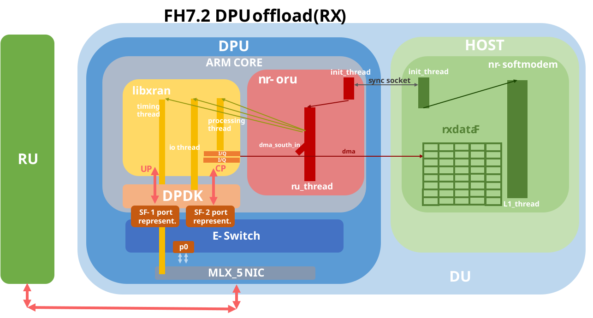

# OAI FH7.2 DPU Offload Bring-up and DMA Proposal

Author: Qizhi Pan  
Branch: `nr-oru_dma`  
Base branch: `develop`  
Base commit: `d420f8c1231e9651e299b714fde53e392c6880ec`


---

## 1. Summary

This document summarizes the current status of the OAI FH7.2 DPU offload work.

The current goal is to move part of the FH7.2 front-haul processing path to the DPU. In the current setup:

- `nr-oru` runs on the DPU/device side.
- `nr-softmodem` runs on the host side.
- The host-side `nr-softmodem` provides the required gNB configuration to `nr-oru` through socket synchronization.
- The DPU-side `nr-oru` uses `libxran` and DPDK to receive FH7.2 traffic from the RU.
- The mlx NIC has been integrated with `libxran`.
- `nr-oru` can connect to the RU and receive stable traffic.
- DMA transfer from DPU to host `rxdataF` is not implemented yet.
- The current DMA work is in architecture analysis and design stage.

Current high-level data path:

```text
RU
  -> DPU NIC
  -> DPDK
  -> libxran
  -> nr-oru on DPU
  -> FH7.2 packet processing
  -> IQ decompression
  -> rxdataF path
````

Target future data path:

```text
RU
  -> DPU NIC
  -> DPDK
  -> libxran
  -> nr-oru on DPU
  -> FH7.2 packet processing
  -> IQ decompression on DPU
  -> DMA-safe staging buffer
  -> asynchronous DMA over PCIe
  -> host-side rxdataF
```

---

## 2. Develop Log

### 2.1 Completed

* Integrated mlx NIC with `libxran`.
* Configured two Scalable Functions.
* Assigned corresponding MAC addresses to the Scalable Functions.
* Adapted `libxran` to work with the mlx NIC.
* Brought up `nr-oru` on the DPU/device side.
* Brought up `nr-softmodem` on the host side.
* Verified that `nr-softmodem` can provide the required gNB configuration to `nr-oru` through socket synchronization.
* Verified that `nr-oru` can connect to the RU.
* Verified that `nr-oru` can receive stable RU traffic.

### 2.2 In Progress

* Documenting the current DPU-host split.
* Documenting the required DPU setup and run procedure.
* Analyzing the current `rxdataF` data path.
* Analyzing the current memcpy location in the FH7.2 RX path.
* Designing a possible DMA-based replacement for the current copy path.

### 2.3 Not Completed Yet

* DMA transfer from DPU to host `rxdataF` is not implemented yet.
* Throughput benchmarking has not been performed yet.
* memcpy vs DMA performance comparison has not been performed yet.
* Host-side `rxdataF` DMA mapping is not finalized yet.
* DMA-safe staging buffer is not implemented yet.
* DMA completion and slot-ready synchronization are not implemented yet.

---

## 3. Designed Architecture

### 3.1 Host / DPU Split

Current runtime split:

```text
Host:
  - Runs nr-softmodem
  - Provides gNB configuration
  - Sends required configuration to nr-oru through socket synchronization
  - Will eventually consume host-side rxdataF

DPU:
  - Runs nr-oru
  - Owns the DPDK-controlled mlx NIC
  - Runs libxran
  - Receives FH7.2 traffic from the RU
  - Performs FH7.2 packet processing
  - Performs IQ decompression
  - Will eventually submit DMA transfers to host rxdataF
```

### 3.2 Current Data Path

```text
RU
  -> DPU NIC
  -> DPDK RX
  -> libxran
  -> FH7.2 packet parsing
  -> PRB map / section handling
  -> IQ decompression
  -> local temporary buffer
  -> memcpy
  -> rxdataF
```

### 3.3 Target Data Path With DMA

```text
RU
  -> DPU NIC
  -> DPDK RX
  -> libxran
  -> FH7.2 packet parsing
  -> PRB map / section handling
  -> IQ decompression
  -> DPU DMA-safe staging buffer
  -> asynchronous SG DMA
  -> host-side rxdataF
```

The main target is not only to replace a CPU memcpy with DMA, but also to avoid using DPU-local `rxdataF` as the final destination when the actual consumer is on the host.

---

## 4. DPU System Prerequisites

### 4.1 General FH7.2 configuration
#### Isolated Cores:
```
ubuntu@localhost:~$ cat /proc/cmdline
BOOT_IMAGE=/boot/vmlinuz-5.15.0-1065-bluefield root=UUID=873755c1-5999-49c0-9976-0659d04bcc52 ro console=hvc0 console=ttyAMA0 iommu.passthrough=1 isolcpus=4-15 nohz_full=4-15 rcu_nocbs=4-15 kthread_cpus=0-3 default_hugepagesz=1G hugepagesz=1G hugepages=12 skew_tick=1 tsc=reliable iommu=pt mitigations=off
```
#### PTP configuration
see [ORAN_FHI7.2_Tutorial](ORAN_FHI7.2_Tutorial.md) PTP configuration section

#### Compile Libxran
We currently use `F_release` libxran, instead of applying the patch `oaioran_F.patch`, we apply `bf3_oru_F.patch`. It's in the same directory as the previous patch.  
After applying `bf3_oru_F.patch`, we compile using:
```
cd ~/phy/fhi_lib/lib
export WIRELESS_SDK_TOOLCHAIN=gcc
export RTE_SDK=/opt/mellanox/dpdk
export XRAN_DIR=$HOME/phy/fhi_lib

make clean
make XRAN_LIB_SO=1 TARGET=armv8
```

### 4.2 Scalable function configuration
It's more encouraged to use SF than VF on DPU, for more information, check [here](https://docs.nvidia.com/doca/sdk/bluefield-scalable-function-user-guide/index.html)   
Nvidia says "SFs allow support for a larger number of functions than VFs, and more importantly, they allow running multiple services concurrently on the DPU" It seems that to utilize the advantages of SFs, we need to scale up the SFs usage, but it can have conflicts with its limited number of cpu cores(for our case).    
We need SF(or VF) because: 1. RU need specific MAC address to communicate. 2. DPDK need devices to bind.    
Let's assume we need setup for `benetel_650_46` as RU.
```
|O-RU            |Lockable Resource |MAC Addres       |DU MAC Address      |VLAN tag|Band|Center frequency|TDD config|
|----------------|------------------|-----------------|--------------------|--------|----|----------------|----------|
|Benetel RAN650  |ORU_Benetel_650_46|8c:1f:64:d1:10:46|00:11:22:33:44:66/67|5       |n77u|3950.4          |DDDSU     |
```
#### One-click script
<details>
<summary><b>Click to expand</b></summary>

```sh   

#!/bin/sh
set -e

# ==================== [Parameter Configuration] ====================
PCI_DEV="0000:03:00.0"               # DPU Physical NIC PCI Address
VLAN_ID=5                            # Fronthaul VLAN ID
MTU_SIZE=9000                        # Fronthaul MTU limit

# SF Numbers
U_PLANE_SF=33                        # U-Plane SF Number
C_PLANE_SF=34                        # C-Plane SF Number

U_PLANE_MAC="00:11:22:33:44:66"      # U-Plane MAC
C_PLANE_MAC="00:11:22:33:44:67"      # C-Plane MAC

MLXDEVM_BIN="/opt/mellanox/iproute2/sbin/mlxdevm"

echo ">>> Starting BlueField Dual-SF Configuration..."

# ==================== Phase 1: Create the SF ====================
if ! $MLXDEVM_BIN port show | grep -q "sfnum ${U_PLANE_SF}"; then
    echo "Creating U-Plane SF ${U_PLANE_SF}..."
    $MLXDEVM_BIN port add pci/${PCI_DEV} flavour pcisf pfnum 0 sfnum ${U_PLANE_SF}
fi

if ! $MLXDEVM_BIN port show | grep -q "sfnum ${C_PLANE_SF}"; then
    echo "Creating C-Plane SF ${C_PLANE_SF}..."
    $MLXDEVM_BIN port add pci/${PCI_DEV} flavour pcisf pfnum 0 sfnum ${C_PLANE_SF}
fi

# ==================== Phase 2: Configure the SF ====================
SF33_INDEX=$($MLXDEVM_BIN port show | grep "sfnum ${U_PLANE_SF}" | head -n 1 | awk -F'/' '{print $3}' | awk -F':' '{print $1}')
SF34_INDEX=$($MLXDEVM_BIN port show | grep "sfnum ${C_PLANE_SF}" | head -n 1 | awk -F'/' '{print $3}' | awk -F':' '{print $1}')

if [ -z "$SF33_INDEX" ] || [ -z "$SF34_INDEX" ]; then
    echo "ERROR: Could not parse sf_index from mlxdevm."
    exit 1
fi

echo "Configuring Hardware MAC and Trust mode..."
$MLXDEVM_BIN port function set pci/${PCI_DEV}/${SF33_INDEX} state inactive
$MLXDEVM_BIN port function set pci/${PCI_DEV}/${SF33_INDEX} hw_addr ${U_PLANE_MAC} trust on state active

$MLXDEVM_BIN port function set pci/${PCI_DEV}/${SF34_INDEX} state inactive
$MLXDEVM_BIN port function set pci/${PCI_DEV}/${SF34_INDEX} hw_addr ${C_PLANE_MAC} trust on state active

# ====================================================
sleep 3
# ==================== Phase 3: Deploy the SF ====================
echo "Deploying SFs (Unbind/Bind Driver)..."
for dev_path in /sys/bus/auxiliary/devices/mlx5_core.sf.*; do
    if [ -f "$dev_path/sfnum" ]; then
        current_sfnum=$(cat "$dev_path/sfnum")
        if [ "$current_sfnum" = "${U_PLANE_SF}" ] || [ "$current_sfnum" = "${C_PLANE_SF}" ]; then
            SERIAL_NAME=$(basename "$dev_path")
            echo "Binding $SERIAL_NAME (SF $current_sfnum)..."
            echo "$SERIAL_NAME" > /sys/bus/auxiliary/drivers/mlx5_core.sf_cfg/unbind 2>/dev/null || true
            echo "$SERIAL_NAME" > /sys/bus/auxiliary/drivers/mlx5_core.sf/bind 2>/dev/null || true
        fi
    fi
done

sleep 3 # Wait for the kernel to create the netdev interfaces

# ==================== Phase 4: Network Layer & Datapath ====================
REP_33="en3f0pf0sf${U_PLANE_SF}"
REP_34="en3f0pf0sf${C_PLANE_SF}"

NET_33=""
NET_34=""
for net_dev in /sys/class/net/*; do
    dev_name=$(basename "$net_dev")
    if [ "$dev_name" != "$REP_33" ] && [ "$dev_name" != "$REP_34" ] && ! echo "$dev_name" | grep -q "\."; then

        port_name=$(cat "$net_dev/phys_port_name" 2>/dev/null || echo "unsupported")
        if [ "$port_name" = "pf0sf${U_PLANE_SF}" ]; then NET_33="$dev_name"; fi
        if [ "$port_name" = "pf0sf${C_PLANE_SF}" ]; then NET_34="$dev_name"; fi
        
        if echo "$dev_name" | grep -E -q "s${U_PLANE_SF}$"; then NET_33="$dev_name"; fi
        if echo "$dev_name" | grep -E -q "s${C_PLANE_SF}$"; then NET_34="$dev_name"; fi
    fi
done

if [ -z "$NET_33" ]; then NET_33="enp3s0f0s${U_PLANE_SF}"; fi
if [ -z "$NET_34" ]; then NET_34="enp3s0f0s${C_PLANE_SF}"; fi

echo "Mapped SF${U_PLANE_SF} to Netdev: $NET_33"
echo "Mapped SF${C_PLANE_SF} to Netdev: $NET_34"

# Set MTU
ip link set dev p0 mtu 9216 up || true
ip link set dev ${REP_33} mtu 9216 up || true
ip link set dev ${NET_33} mtu 9216 up || true
ip link set dev ${REP_34} mtu 9216 up || true
ip link set dev ${NET_34} mtu 9216 up || true

# Setup VLANs
echo "Building VLAN $VLAN_ID interfaces..."
ip link delete dev ${NET_33}.${VLAN_ID} 2>/dev/null || true
ip link add link ${NET_33} name ${NET_33}.${VLAN_ID} type vlan id ${VLAN_ID}
ip link set dev ${NET_33}.${VLAN_ID} mtu ${MTU_SIZE} up

ip link delete dev ${NET_34}.${VLAN_ID} 2>/dev/null || true
ip link add link ${NET_34} name ${NET_34}.${VLAN_ID} type vlan id ${VLAN_ID}
ip link set dev ${NET_34}.${VLAN_ID} mtu ${MTU_SIZE} up

# ==================== Phase 5: Hardware Offloaded Flow Insertion ====================
echo "Programming eSwitch TCAM with VLAN Pop & Redirect..."

# Clean all ingress in p0
tc filter del dev p0 ingress 2>/dev/null || true

# Hardware steer U-Plane eCPRI traffic (Match -> Pop VLAN -> Redirect to SF)
tc filter add dev p0 ingress protocol 802.1Q pref 1 flower \
  vlan_id ${VLAN_ID} \
  vlan_ethtype 0xaefe \
  dst_mac ${U_PLANE_MAC} \
  action vlan pop \
  action mirred egress redirect dev ${REP_33}

# Hardware steer C-Plane eCPRI traffic (Match -> Pop VLAN -> Redirect to SF)
tc filter add dev p0 ingress protocol 802.1Q pref 2 flower \
  vlan_id ${VLAN_ID} \
  vlan_ethtype 0xaefe \
  dst_mac ${C_PLANE_MAC} \
  action vlan pop \
  action mirred egress redirect dev ${REP_34}

# Clean all ingress in 2 SFs
tc filter del dev ${REP_33} ingress 2>/dev/null || true
tc filter del dev ${REP_34} ingress 2>/dev/null || true

# Hardware steer U-Plane eCPRI traffic (SF_uplane -> Match -> Add VLAN -> Redirect to p0)
tc filter add dev ${REP_33} ingress protocol 802.1Q pref 1 flower \
  vlan_ethtype 0xaefe \
  action vlan push id ${VLAN_ID} \
  action mirred egress redirect dev p0

# Hardware steer C-Plane eCPRI traffic (SF_cplane -> Match -> Add VLAN -> Redirect to p0)
tc filter add dev ${REP_34} ingress protocol 802.1Q pref 1 flower \
  vlan_ethtype 0xaefe \
  action vlan push id ${VLAN_ID} \
  action mirred egress redirect dev p0

echo ">>> SUCCESS: Configuration complete!"
exit 0
```
</details>

#### Step by Step Instruction


This section shows how to manually configure two BlueField Scalable Functions for the current `nr-oru` FH7.2 setup.

The target setup is:

| Plane | SF Number | DU MAC Address | VLAN |
|---|---:|---|---:|
| U-Plane | 33 | `00:11:22:33:44:66` | 5 |
| C-Plane | 34 | `00:11:22:33:44:67` | 5 |

The DPU physical NIC PCI device is:

```text
0000:03:00.0
````

The expected bidirectional datapath is:

```text
RX:
RU -> p0 -> E-Switch -> SF representor -> SF netdev / DPDK -> libxran -> nr-oru

TX:
nr-oru -> libxran -> DPDK -> SF netdev -> SF representor -> E-Switch -> p0 -> RU
```

---

##### Step 1: Define the parameters

```sh
PCI_DEV="0000:03:00.0"

VLAN_ID=5
MTU_SIZE=9000

U_PLANE_SF=33
C_PLANE_SF=34

U_PLANE_MAC="00:11:22:33:44:66"
C_PLANE_MAC="00:11:22:33:44:67"

MLXDEVM="sudo /opt/mellanox/iproute2/sbin/mlxdevm"
```

---

##### Step 2: Create the two SFs

Create the U-plane SF:

```sh
$MLXDEVM port add pci/${PCI_DEV} flavour pcisf pfnum 0 sfnum ${U_PLANE_SF}
```

Create the C-plane SF:

```sh
$MLXDEVM port add pci/${PCI_DEV} flavour pcisf pfnum 0 sfnum ${C_PLANE_SF}
```

Verify that the two SFs were created:

```sh
$MLXDEVM port show | grep -E "sfnum ${U_PLANE_SF}|sfnum ${C_PLANE_SF}"
```

Expected result should contain entries similar to:

```text
sfnum 33
sfnum 34
```

This setup uses SFs, not SR-IOV VFs. The important field is:

```text
flavour pcisf
```

---

##### Step 3: Find the internal SF port indexes

The `sfnum` is the user-defined SF number, but `mlxdevm port function set` needs the internal SF port index.

Find the U-plane SF index:

```sh
SF33_INDEX=$($MLXDEVM port show | grep "sfnum ${U_PLANE_SF}" | head -n 1 | awk -F'/' '{print $3}' | awk -F':' '{print $1}')
echo $SF33_INDEX
```

Find the C-plane SF index:

```sh
SF34_INDEX=$($MLXDEVM port show | grep "sfnum ${C_PLANE_SF}" | head -n 1 | awk -F'/' '{print $3}' | awk -F':' '{print $1}')
echo $SF34_INDEX
```

Verify that both variables are not empty:

```sh
echo "SF33_INDEX=${SF33_INDEX}"
echo "SF34_INDEX=${SF34_INDEX}"
```

---

##### Step 4: Configure hardware MAC address and trust mode

Deactivate the U-plane SF before changing its function attributes:

```sh
$MLXDEVM port function set pci/${PCI_DEV}/${SF33_INDEX} state inactive
```

Configure the U-plane SF MAC address and enable trust mode:

```sh
$MLXDEVM port function set pci/${PCI_DEV}/${SF33_INDEX} hw_addr ${U_PLANE_MAC} trust on state active
```

Deactivate the C-plane SF before changing its function attributes:

```sh
$MLXDEVM port function set pci/${PCI_DEV}/${SF34_INDEX} state inactive
```

Configure the C-plane SF MAC address and enable trust mode:

```sh
$MLXDEVM port function set pci/${PCI_DEV}/${SF34_INDEX} hw_addr ${C_PLANE_MAC} trust on state active
```

Verify the configuration:

```sh
$MLXDEVM port show | grep -E "sfnum ${U_PLANE_SF}|sfnum ${C_PLANE_SF}|hw_addr|state"
```

The configured MAC addresses should match the DU MAC addresses expected by the RU.

---

##### Step 5: Find the auxiliary SF device names

After the SFs are created and activated, the kernel creates auxiliary SF devices under:

```text
/sys/bus/auxiliary/devices/mlx5_core.sf.*
```

The auxiliary device name is not the same as the SF number. For example:

```text
sfnum 33 -> mlx5_core.sf.2
sfnum 34 -> mlx5_core.sf.4
```

Find the mapping manually:

```sh
for dev_path in /sys/bus/auxiliary/devices/mlx5_core.sf.*; do
    if [ -f "$dev_path/sfnum" ]; then
        echo "$(basename $dev_path): sfnum=$(cat $dev_path/sfnum)"
    fi
done
```

Example output:


Set the auxiliary device names according to the output on your machine:

```sh
U_PLANE_AUX_DEV="mlx5_core.sf.2"
C_PLANE_AUX_DEV="mlx5_core.sf.4"
```

Replace `mlx5_core.sf.2` and `mlx5_core.sf.4` if your system shows different names.

---

##### Step 6: Bind the SFs to the runtime SF driver

Unbind the U-plane SF from the SF configuration driver:

```sh
echo "${U_PLANE_AUX_DEV}" | sudo tee /sys/bus/auxiliary/drivers/mlx5_core.sf_cfg/unbind
```

Bind the U-plane SF to the runtime SF driver:

```sh
echo "${U_PLANE_AUX_DEV}" | sudo tee /sys/bus/auxiliary/drivers/mlx5_core.sf/bind
```

Unbind the C-plane SF from the SF configuration driver:

```sh
echo "${C_PLANE_AUX_DEV}" | sudo tee /sys/bus/auxiliary/drivers/mlx5_core.sf_cfg/unbind
```

Bind the C-plane SF to the runtime SF driver:

```sh
echo "${C_PLANE_AUX_DEV}" | sudo tee /sys/bus/auxiliary/drivers/mlx5_core.sf/bind
```

Wait for the kernel to create the SF netdev interfaces

---

##### Step 7: Identify the SF representors

The SF representor names are expected to be:

```sh
REP_33="en3f0pf0sf${U_PLANE_SF}"
REP_34="en3f0pf0sf${C_PLANE_SF}"
```

Verify that they exist:

```sh
ip link show ${REP_33}
ip link show ${REP_34}
```

Expected names:

```text
en3f0pf0sf33
en3f0pf0sf34
```

---

##### Step 8: Identify the SF netdev interfaces

The SF netdev names can vary across systems. Check the netdev mapping by reading `phys_port_name`:

```sh
for net_dev in /sys/class/net/*; do
    dev_name=$(basename "$net_dev")
    port_name=$(cat "$net_dev/phys_port_name" 2>/dev/null || true)
    if [ -n "$port_name" ]; then
        echo "$dev_name: $port_name"
    fi
done
```

Look for:

```text
...pf0sf33
...pf0sf34
```

Set the corresponding netdev names:

```sh
NET_33="<netdev-for-sf33>"
NET_34="<netdev-for-sf34>"
```

For example:

```sh
NET_33="enp3s0f0s33"
NET_34="enp3s0f0s34"
```

Verify:

```sh
sudo ip link show ${NET_33}
sudo ip link show ${NET_34}
```

---

##### Step 9: Set MTU and bring up the physical port, representors, and SF netdevs

Bring up the physical port:

```sh
sudo ip link set dev p0 mtu 9216 up
```

Bring up the U-plane representor and SF netdev:

```sh
sudo ip link set dev ${REP_33} mtu 9216 up
sudo ip link set dev ${NET_33} mtu 9216 up
```

Bring up the C-plane representor and SF netdev:

```sh
sudo ip link set dev ${REP_34} mtu 9216 up
sudo ip link set dev ${NET_34} mtu 9216 up
```

Verify:

```sh
sudo ip link show p0
sudo ip link show ${REP_33}
sudo ip link show ${NET_33}
sudo ip link show ${REP_34}
sudo ip link show ${NET_34}
```

---

##### Step 10: Create VLAN interfaces on the SF netdevs

Delete existing VLAN interfaces if they already exist:

```sh
sudo ip link delete dev ${NET_33}.${VLAN_ID} 2>/dev/null || true
sudo ip link delete dev ${NET_34}.${VLAN_ID} 2>/dev/null || true
```

Create the U-plane VLAN interface:

```sh
sudo ip link add link ${NET_33} name ${NET_33}.${VLAN_ID} type vlan id ${VLAN_ID}
sudo ip link set dev ${NET_33}.${VLAN_ID} mtu ${MTU_SIZE} up
```

Create the C-plane VLAN interface:

```sh
sudo ip link add link ${NET_34} name ${NET_34}.${VLAN_ID} type vlan id ${VLAN_ID}
sudo ip link set dev ${NET_34}.${VLAN_ID} mtu ${MTU_SIZE} up
```

Verify:

```sh
sudo ip link show ${NET_33}.${VLAN_ID}
sudo ip link show ${NET_34}.${VLAN_ID}
```

---

##### Step 11: Install RX steering rules from p0 to the SFs

First, clear existing ingress rules on `p0`:

```sh
sudo tc filter del dev p0 ingress 2>/dev/null || true
```

Install the U-plane RX steering rule:

```sh
sudo tc filter add dev p0 ingress protocol 802.1Q pref 1 flower \
  vlan_id ${VLAN_ID} \
  vlan_ethtype 0xaefe \
  dst_mac ${U_PLANE_MAC} \
  action vlan pop \
  action mirred egress redirect dev ${REP_33}
```

Install the C-plane RX steering rule:

```sh
sudo tc filter add dev p0 ingress protocol 802.1Q pref 2 flower \
  vlan_id ${VLAN_ID} \
  vlan_ethtype 0xaefe \
  dst_mac ${C_PLANE_MAC} \
  action vlan pop \
  action mirred egress redirect dev ${REP_34}
```

These rules implement:

```text
RU -> p0 -> match VLAN 5 + eCPRI + destination MAC -> pop VLAN -> redirect to SF representor
```

---

##### Step 12: Install TX steering rules from the SFs back to p0

First, clear existing ingress rules on the SF representors:

```sh
sudo tc filter del dev ${REP_33} ingress 2>/dev/null || true
sudo tc filter del dev ${REP_34} ingress 2>/dev/null || true
```

Install the U-plane TX steering rule:

```sh
sudo tc filter add dev ${REP_33} ingress protocol 0xaefe pref 1 flower \
  action vlan push id ${VLAN_ID} protocol 802.1Q priority 0 \
  action mirred egress redirect dev p0
```

Install the C-plane TX steering rule:

```sh
sudo tc filter add dev ${REP_34} ingress protocol 0xaefe pref 1 flower \
  action vlan push id ${VLAN_ID} protocol 802.1Q priority 0 \
  action mirred egress redirect dev p0
```

These rules implement:

```text
SF representor -> match eCPRI -> push VLAN 5 -> redirect to p0 -> RU
```

---

##### Step 13: Verify TC hardware offload

Check the RX steering rules on `p0`:

```sh
sudo tc filter show dev p0 ingress
```

Expected result should include:

```text
vlan_id 5
vlan_ethtype 0xaefe
dst_mac 00:11:22:33:44:66
dst_mac 00:11:22:33:44:67
action vlan pop
redirect to en3f0pf0sf33 / en3f0pf0sf34
in_hw
```

Check the TX steering rules on the SF representors:

```sh
sudo tc filter show dev ${REP_33} ingress
sudo tc filter show dev ${REP_34} ingress
```

Expected result should include:

```text
eth_type aefe
action vlan push id 5
redirect to p0
in_hw
```

The `in_hw` flag is important. It means the rule has been offloaded to the NIC/E-Switch hardware.

---

##### Step 14: Final expected datapath

After the configuration is complete, the RX path should be:

```text
RU
  -> p0
  -> E-Switch TC rule
  -> match VLAN 5 + eCPRI + DU MAC
  -> pop VLAN
  -> redirect to SF33 or SF34 representor
  -> SF netdev / DPDK
  -> libxran
  -> nr-oru
```

The TX path should be:

```text
nr-oru
  -> libxran
  -> DPDK
  -> SF netdev
  -> SF representor
  -> E-Switch TC rule
  -> push VLAN 5
  -> redirect to p0
  -> RU
```

At this point, `nr-oru` should be able to use the SF-backed DPDK devices for FH7.2 traffic.
### 4.3 Config File Moderation
For `benetel_650_46`, the current deployment use two config file
```
gnb-du.sa.band77.273prb.fhi72.4x4-benetel650.nr-oru.device.conf
```
```
gnb-du.sa.band77.273prb.fhi72.4x4-benetel650.nr-oru.host.conf
```
We add `dma_ctrl_ip` and `dma_ctrl_port` in RUs section. This is used for device and host to exchange information.
```
  dma_ctrl_ip    = "192.168.100.1"; 
  dma_ctrl_port  = 3889;
```

In `dpdk_devices`, fill in the auxiliary device that we had in the previous steps

```text
dpdk_devices = ("mlx5_core.sf.2", "mlx5_core.sf.4");
```
## 5. Current Runtime status
After all the configuration are done. We compile our OAI fh library on both DPU and host(which is falcon in our case).

```
./build_oai -C --gNB --ninja -t oran_fhlib_5g --cmake-opt -Dxran_LOCATION=$HOME/phy/fhi_lib/lib --cmake-opt -Darmral_LOCATION=$HOME/ral --cmake-opt -DENABLE_DOCA_DMA=ON
```
On DPU:
```
cd ran_build/build
ninja nr-oru
```
On Host(falcon):
```
cd ran_build/build
ninja nr-softmodem
```


Then run
On DPU:
```
sudo  ./nr-oru -O ../../../targets/PROJECTS/GENERIC-NR-5GC/CONF/gnb-du.sa.band77.273prb.fhi72.4x4-benetel650.nr-oru.device.conf
```
On Host:
```
sudo ./nr-softmodem   -O ../../../targets/PROJECTS/GENERIC-NR-5GC/CONF/gnb-du.sa.band77.273prb.fhi72.4x4-benetel650.nr-oru.host.conf   --thread-pool 4,5,6,7 
```

Then you should see DPU and host do the handshake, `nr-oru` on DPU will continue the libxran initialization, DPDK binding, and ru_thread start ticking and recieved pakages from the RU. `nr-softmodem` will soon have `segment fault` or `error` in current stage(we don't care about it right now. We will care about later)

Expected DPU log:   
<details>
<summary><b>Click to expand</b></summary>

```text
ubuntu@localhost:~/panq/openairinterface5g/cmake_targets/ran_build/build$ sudo  ./nr-oru -O ../../../targets/PROJECTS/GENERIC-NR-5GC/CONF/gnb-du.sa.band77.273prb.fhi72.4x4-benetel650.nr-oru.device.conf
CMDLINE: "./nr-oru" "-O" "../../../targets/PROJECTS/GENERIC-NR-5GC/CONF/gnb-du.sa.band77.273prb.fhi72.4x4-benetel650.nr-oru.device.conf" 
[CONFIG] function config_libconfig_init returned 0
[PHY]    ./nr-oru is experimental software and at this point is not an implementation of a 7.2 O-RAN RU
Reading in command-line options
configuring for RRU
[HW]     Version: Branch: nr-oru_dma Abrev. Hash: fc3f253a60 Date: Thu May 7 12:23:46 2026 +0000
About to Init RU threads
[PHY]    number of L1 instances 0, number of RU 1, number of CPU cores 16
[PHY]    No local L1 instance in nr-oru. Setting sync_var to 0
[PHY]    DMA [Device]: Initializing Control Plane handshake with Host at 192.168.100.1:3889
[PHY]    DMA: Waiting for Host to come online...
[PHY]    DMA: Waiting for config from Host (Expected: 2336 bytes)...
[PHY]    DMA: Received 1448 bytes chunk (Total: 1448/2336)
[PHY]    DMA: Received 888 bytes chunk (Total: 2336/2336)
[PHY]    ✅ DMA: Handshake SUCCESS! All 2336 bytes received.
[PHY]    ✅ DMA: Shadow gNB configuration tree successfully rebuilt!
[PHY]    ========================================================
[PHY]              [DMA Device] SHADOW gNB CONFIG DUMP           
[PHY]    ========================================================
[PHY]    [Cell] PCI: 0, Duplex Type: 1 (0:FDD, 1:TDD)
[PHY]    [SSB] SCS Common: 1, Mask0: 0x80000000, Mask1: 0x00000000
[PHY]    [PRACH] Config Index: 152, FD Occasions: 1, Seq Length: 1
[PHY]    [Carrier] DL Grid Size (PRBs): 273, UL Grid Size: 273
[PHY]    [Antenna] RX: 4, TX: 4
[PHY]    [TDD] Periodicity: 5
[PHY]    [TDD] Frame layout for SCS=1 (Printing first 20 slots):
[PHY]          Slot  0: [DDDDDDDDDDDDDD]
[PHY]          Slot  1: [DDDDDDDDDDDDDD]
[PHY]          Slot  2: [DDDDDDDDDDDDDD]
[PHY]          Slot  3: [DDDDDDFFFFUUUU]
[PHY]          Slot  4: [UUUUUUUUUUUUUU]
[PHY]          Slot  5: [DDDDDDDDDDDDDD]
[PHY]          Slot  6: [DDDDDDDDDDDDDD]
[PHY]          Slot  7: [DDDDDDDDDDDDDD]
[PHY]          Slot  8: [DDDDDDFFFFUUUU]
[PHY]          Slot  9: [UUUUUUUUUUUUUU]
[PHY]          Slot 10: [DDDDDDDDDDDDDD]
[PHY]          Slot 11: [DDDDDDDDDDDDDD]
[PHY]          Slot 12: [DDDDDDDDDDDDDD]
[PHY]          Slot 13: [DDDDDDFFFFUUUU]
[PHY]          Slot 14: [UUUUUUUUUUUUUU]
[PHY]          Slot 15: [DDDDDDDDDDDDDD]
[PHY]          Slot 16: [DDDDDDDDDDDDDD]
[PHY]          Slot 17: [DDDDDDDDDDDDDD]
[PHY]          Slot 18: [DDDDDDFFFFUUUU]
[PHY]          Slot 19: [UUUUUUUUUUUUUU]
[PHY]    ========================================================
[PHY]    DMA: Control Plane handshake completed. Shadow gNB is ready.
[PHY]    Standalone ORU mode: PUCCH, PUSCH, and SRS queues successfully mock-initialized.
[PHY]    Initialized RU proc 0 (NGFI_RAU_IF4p5,synch_to_ext_device),
[PHY]    RU thread-pool core string -1,-1 (size 2)
[UTIL]   threadCreate() for Tpool0_-1: creating thread with affinity ffffffff, priority 97
[UTIL]   threadCreate() for Tpool1_-1: creating thread with affinity ffffffff, priority 97
[UTIL]   threadCreate() for ru_thread: creating thread with affinity 9, priority 97
[PHY]    Starting RU 0 (NGFI_RAU_IF4p5,synch_to_ext_device) on cpu 4
[PHY]    Initializing frame parms for mu 1, N_RB 273, Ncp 0
[PHY]    Init: N_RB_DL 273, first_carrier_offset 2458, nb_prefix_samples 288,nb_prefix_samples0 352, ofdm_symbol_size 4096
[PHY]    fp->scs=30000
[PHY]    fp->ofdm_symbol_size=4096
[PHY]    fp->nb_prefix_samples0=352
[PHY]    fp->nb_prefix_samples=288
[PHY]    fp->slots_per_subframe=2
[PHY]    fp->samples_per_subframe_wCP=114688
[PHY]    fp->samples_per_frame_wCP=1146880
[PHY]    fp->samples_per_subframe=122880
[PHY]    fp->samples_per_frame=1228800
[PHY]    fp->dl_CarrierFreq=3950400000
[PHY]    fp->ul_CarrierFreq=3950400000
[PHY]    fp->Nid_cell=0
[PHY]    fp->first_carrier_offset=2458
[PHY]    fp->ssb_start_subcarrier=0
[PHY]    fp->Ncp=0
[PHY]    fp->N_RB_DL=273
[PHY]    fp->numerology_index=1
[PHY]    fp->ofdm_offset_divisor=8
[PHY]    fp->threequarter_fs=0
[PHY]    fp->sl_CarrierFreq=0
[PHY]    fp->N_RB_SL=0
[NR_PHY] nb_tx_streams 4, nb_rx_streams 4, num_Beams_period 1
[PHY]    Setting RF config for N_RB 273, NB_RX 4, NB_TX 4
[PHY]    tune_offset 0 Hz, sample_rate 122880000 Hz
[PHY]    Channel 0: setting tx_gain offset 0, tx_freq 3950400000 Hz
[PHY]    Channel 1: setting tx_gain offset 0, tx_freq 3950400000 Hz
[PHY]    Channel 2: setting tx_gain offset 0, tx_freq 3950400000 Hz
[PHY]    Channel 3: setting tx_gain offset 0, tx_freq 3950400000 Hz
[PHY]    Channel 0: setting rx_gain offset 0, rx_freq 3950400000 Hz
[PHY]    Channel 1: setting rx_gain offset 0, rx_freq 3950400000 Hz
[PHY]    Channel 2: setting rx_gain offset 0, rx_freq 3950400000 Hz
[PHY]    Channel 3: setting rx_gain offset 0, rx_freq 3950400000 Hz
[PHY]    starting transport
[PHY]    Initializing XRAN layer as O-DU
[HW]     Initializing O-RAN 7.2 FH interface through xran library (compiled against headers of oran_f_release_v1.9)
We are initialing the oran!!!!!!!
xran_fh_init:
  io_cfg:
    id 0 (O-DU)
    num_vfs 2
    num_rxq 1
    dpdk_dev [mlx5_core.sf.2, mlx5_core.sf.4, (null), (null), (null), (null), (null), (null), (null), (null), (null), (null), (null), (null), (null), (null)]
    bbdev_dev (null)
    bbdev_mode -1
    dpdkIoVaMode 0
    dpdkMemorySize 8192
    core 12
    system_core 11
    pkt_proc_core 0000000000002000
    pkt_proc_core_64_127 0000000000000000
    pkt_aux_core 0
    timing_core 12
    port (filled within xran library)
    io_sleep 0
    nEthLinePerPort 1
    nEthLineSpeed 10
    one_vf_cu_plane 0
    eowd_cmn[0]:
      initiator_en 0
      numberOfSamples 0
      filterType 0
      responseTo 0
      measVf 0
      measState 0
      measId 0
      measMethod 0
      owdm_enable 0
      owdm_PlLength 0
eowd_port (filled within xran library)
    bbu_offload 0
  eAxCId_conf:
    mask_cuPortId 0xf000
    mask_bandSectorId 0x0f00
    mask_ccId 0x00f0
    mask_ruPortId 0x000f
    bit_cuPortId 0
    bit_bandSectorId 0
    bit_ccId 0
    bit_ruPortId 0
  xran_ports 1
  dpdkBasebandFecMode 0
  dpdkBasebandDevice (null)
  filePrefix wls_0
  mtu 9000
  p_o_du_addr (null)
  p_o_ru_addr [8C:1F:64:D1:10:46, 8C:1F:64:D1:10:46]
  totalBfWeights 0
  mlogxranenable 0
  dlCpProcBurst 0
'MLNX_DPDK 22.11.2504.1.0'
 xran_init: MTU 9000
PF Eth line speed 10G
PF Eth lines per O-xU port 1
RX HW queues per O-xU Eth line 1 
node 0
total cores 16 c_mask 0x00000000000003800 core 12 [id] system_core 11 [id] pkt_proc_core 0x00000000000002000 [mask] pkt_aux_core 0 [id] timing_core 12 [id]
xran_ethdi_init_dpdk_io: Calling rte_eal_init:wls_0 -c 0x00000000000003800 -n2 --iova-mode=pa --socket-mem=8192 --socket-limit=8192 --proc-type=auto --no-telemetry --file-prefix wls_0 -a0000:00:00.0    
EAL: Detected CPU lcores: 16
EAL: Detected NUMA nodes: 1
EAL: Auto-detected process type: PRIMARY
EAL: Detected shared linkage of DPDK
EAL: Multi-process socket /var/run/dpdk/wls_0/mp_socket
EAL: Selected IOVA mode 'PA'
xran_init_mbuf_pool: socket 0
DPU-Fix: Probing device mlx5_core.sf.2
DPU-Fix: Found port 0 for device mlx5_core.sf.2
initializing port 0 for TX, drv=mlx5_auxiliary
set DEV_TX_OFFLOAD_MBUF_FAST_FREE
Port 0 MAC: 00 11 22 33 44 66
Port 0: nb_rxd 4096 nb_txd 4096
[0] mp_rx__p_0_q_0 num blocks 65535
[0] mempool_small__0

Checking link status portid [0]   ... done
Port 0 Link Up - speed 100000 Mbps - full-duplex
DPU-Fix: Probing device mlx5_core.sf.4
DPU-Fix: Found port 1 for device mlx5_core.sf.4
initializing port 1 for TX, drv=mlx5_auxiliary
set DEV_TX_OFFLOAD_MBUF_FAST_FREE
Port 1 MAC: 00 11 22 33 44 67
Port 1: nb_rxd 4096 nb_txd 4096
[1] mp_rx__p_1_q_0 num blocks 65535
[1] mempool_small__1
Created ring tx_ring_cp_1 on core 12
Created ring rx_ring_cp_1_0 on core 12

Checking link status portid [1]   ... done
Port 1 Link Up - speed 100000 Mbps - full-duplex
[ 0] vf  0 local  SRC MAC: 00 11 22 33 44 66
[ 0] vf  0 remote DST MAC: 8c 1f 64 d1 10 46
[ 0] vf  1 local  SRC MAC: 00 11 22 33 44 67
[ 0] vf  1 remote DST MAC: 8c 1f 64 d1 10 46
created dl_gen_ring_up_0 on core 12
testing3.1
xran_fh_config:
  dpdk_port 0
  sector_id 0
  nCC 1
  neAxc 4
  neAxcUl 0
  nAntElmTRx 0
  nDLFftSize 12
  nULFftSize 12
  nDLRBs 273
  nULRBs 273
  nDLAbsFrePointA 0
  nULAbsFrePointA 0
  nDLCenterFreqARFCN 0
  nULCenterFreqARFCN 0
  ttiCb (nil)
  ttiCbParam (nil)
  Tadv_cp_dl 0
  T2a_min_cp_dl 0
  T2a_max_cp_dl 0
  T2a_min_cp_ul 0
  T2a_max_cp_ul 0
  T2a_min_up 0
  T2a_max_up 0
  Ta3_min 0
  Ta3_max 0
  T1a_min_cp_dl 500
  T1a_max_cp_dl 700
  T1a_min_cp_ul 285
  T1a_max_cp_ul 336
  T1a_min_up 294
  T1a_max_up 400
  Ta4_min 0
  Ta4_max 400
  enableCP 1
  prachEnable 1
  srsEnable 0
  puschMaskEnable 0
  puschMaskSlot 0
  debugStop 0
  debugStopCount 0
  DynamicSectionEna 0
  GPS_Alpha 0
  GPS_Beta 0
  srsEnableCp 0
  SrsDelaySym 0
  prach_config:
     nPrachConfIdx 152
     nPrachSubcSpacing 1
     nPrachZeroCorrConf 0
     nPrachRestrictSet 0
     nPrachRootSeqIdx 0
     nPrachFreqStart 0
     nPrachFreqOffset -3276
     nPrachFilterIdx 0
     startSymId 0
     lastSymId 0
     startPrbc 0
     numPrbc 0
     timeOffset 0
     freqOffset 0
     eAxC_offset 4
    nPrachConfIdxLTE 0
  srs_config:
    symbMask 0000
    eAxC_offset 0
  frame_conf:
    nFrameDuplexType TDD
    nNumerology 1
    nTddPeriod 5
    sSlotConfig[0]: DDDDDDDDDDDDDD
    sSlotConfig[1]: DDDDDDDDDDDDDD
    sSlotConfig[2]: DDDDDDDDDDDDDD
    sSlotConfig[3]: DDDDDDGGGGUUUU
    sSlotConfig[4]: UUUUUUUUUUUUUU
  ru_config:
    xranTech NR
    xranCat A
    xranCompHdrType static
    iqWidth 9
    compMeth 1
    iqWidth_PRACH 9
    compMeth_PRACH 1
    fftSize 8
    byteOrder network/BE
    iqOrder I_Q
    xran_max_frame 0
  bbdev_enc (nil)
  bbdev_dec (nil)
  tx_cp_eAxC2Vf 0xffffb1461d00
  tx_up_eAxC2Vf 0xffffb1462900
  rx_cp_eAxC2Vf 0xffffb1463500
  rx_up_eAxC2Vf 0xffffb1464100
  log_level 1
  max_sections_per_slot 0
  max_sections_per_symbol 0
  RunSlotPrbMapBySymbolEnable 0
  dssEnable 0
  dssPeriod 0
  technology[XRAN_MAX_DSS_PERIODICITY] (not filled as DSS disabled)
 xran_open: 5G NR Category A
xRAN open PRACH config: Numerology 1 ConfIdx 152, preambleFmrt 10 startsymb 0, numSymbol 12, occassionsInPrachSlot 1
PRACH: x 2 y[0] 1, y[1] 0 prach slot: 4 .. 9 ..
PRACH start symbol 0 lastsymbol 11
xran_init_vfs_mapping: p 0 vf 0
xran_init_vfs_mapping: p 0 vf 1
xran_open: interval_us=500, interval_us_local=500
bbu_offload 0
XRAN_UP_VF: 0x0000
xran_timing_source_thread [CPU 12] [PID: 1781889]
TTI interval 500 [us]
delay_cp_dl_max=300, sym_cp_dl_max=9, max_dl_offset_sym=19
delay_cp_dl_min=0, sym_cp_dl_min=3, min_dl_offset_sym=15
delay_cp_ul=164,     sym_cp_ul=5,     ul_offset_sym=9
offset_num_slots_cp_dl=1, offset_num_slots_cp_ul=0, offset_num_slots_up_ul=0
C-plane DL from 300 us after TTI  [trigger on sym 9] to 0 us after TTI [trigger on sym 3]
Start C-plane UL 164 us after TTI  [trigger on sym 5]
Start U-plane DL 400 us before OTA [offset  in sym -11]
Start U-plane UL 400 us OTA        [offset  in sym 12]
C-plane to U-plane delay 300 us after TTI
O-XU      0
HW        0
Num cores 2
Num ports 1
O-RU Cat  0
O-RU CC   1
O-RU eAxC 4
Start Sym timer 0 ns
p:0 XRAN_JOB_TYPE_CP_DL worker id 1
p:0 XRAN_JOB_TYPE_CP_UL worker id 1
created sym cp dl cb for symbol 9
created sym cp dl cb for symbol 10
created sym cp dl cb for symbol 11
created sym cp dl cb for symbol 12
created sym cp dl cb for symbol 13
xran_generic_worker_thread [CPU 13] [PID: 1781889]
spawn worker 0 core 13
xran_open [CPU 11] [PID: 1781889]
Waiting on Timing thread...
Initialize ORAN port instance 0 (1) sector 0
testing3.2
[HW]     Please be aware that F release support will be removed in the future. Consider switching to K release.
xran_sector_get_instances() o_xu_id 0 xran_handle 0xffff7cdae040
xran_sector_get_instances [0]: CC 0 handle 0xffffaa3cbc00
Handle: 0xffffb0074330 Instance: 0xffffaa3cbc00
-> hInstance 0xffffaa3cbc00
ru_0_cc_0_idx_0: [ handle 0xffffaa3cbc00 0 0 ] [nPoolIndex 0] nNumberOfBuffers 2047 nBufferSize 14116 socket_id 0
CC:[ handle 0xffffaa3cbc00 ru 0 cc_idx 0 ] [nPoolIndex 0] mb pool 0x27ed02640 
xran_bm_init() hInstance 0xffffaa3cbc00 poolIdx 0 elements 2047 size 14116
xran_bm_allocate_buffer() hInstance 0xffffaa3cbc00 poolIdx 0 count 1120
ru_0_cc_0_idx_1: [ handle 0xffffaa3cbc00 0 0 ] [nPoolIndex 1] nNumberOfBuffers 2047 nBufferSize 6992 socket_id 0
CC:[ handle 0xffffaa3cbc00 ru 0 cc_idx 0 ] [nPoolIndex 1] mb pool 0x2c2e78440 
xran_bm_init() hInstance 0xffffaa3cbc00 poolIdx 1 elements 2047 size 6992
xran_bm_allocate_buffer() hInstance 0xffffaa3cbc00 poolIdx 1 count 80
ru_0_cc_0_idx_2: [ handle 0xffffaa3cbc00 0 0 ] [nPoolIndex 2] nNumberOfBuffers 2047 nBufferSize 13168 socket_id 0
CC:[ handle 0xffffaa3cbc00 ru 0 cc_idx 0 ] [nPoolIndex 2] mb pool 0x2c2e7dd00 
xran_bm_init() hInstance 0xffffaa3cbc00 poolIdx 2 elements 2047 size 13168
xran_bm_allocate_buffer() hInstance 0xffffaa3cbc00 poolIdx 2 count 1120
ru_0_cc_0_idx_3: [ handle 0xffffaa3cbc00 0 0 ] [nPoolIndex 3] nNumberOfBuffers 2047 nBufferSize 6992 socket_id 0
CC:[ handle 0xffffaa3cbc00 ru 0 cc_idx 0 ] [nPoolIndex 3] mb pool 0x2c2e7d640 
xran_bm_init() hInstance 0xffffaa3cbc00 poolIdx 3 elements 2047 size 6992
xran_bm_allocate_buffer() hInstance 0xffffaa3cbc00 poolIdx 3 count 80
ru_0_cc_0_idx_4: [ handle 0xffffaa3cbc00 0 0 ] [nPoolIndex 4] nNumberOfBuffers 2047 nBufferSize 3360 socket_id 0
CC:[ handle 0xffffaa3cbc00 ru 0 cc_idx 0 ] [nPoolIndex 4] mb pool 0x2c2e82e80 
xran_bm_init() hInstance 0xffffaa3cbc00 poolIdx 4 elements 2047 size 3360
xran_bm_allocate_buffer() hInstance 0xffffaa3cbc00 poolIdx 4 count 1120
testing3.2
testing3.3
testing3.4
testing3.5
testing3.6
[HW]     [RAU] has loaded ETHERNET trasport protocol.
[PHY]    testing1
[PHY]    testing2
ORAN: get_internal_parameter (requesting: fh_if4p5_south_in_dma_device)
[PHY]    testing2.1 (DMA DEVICE IN)
ORAN: get_internal_parameter (requesting: fh_if4p5_south_out_dma_device)
[PHY]    testing2.2 (DMA DEVICE OUT)
[PHY]    testing3
[PHY]    RU 0: manually set CPU affinity to CPU 9
[PHY]    Starting IF interface for RU 0, nb_rx 4
ORAN: trx_oran_start
O-DU: XRAN start time: 05/22/26 15:38:00.022295770 UTC [500]
Start ORAN. Done
[PHY]    RU 0 Setting N_TA_offset to 1600 samples (UL Freq 3901260, N_RB 273, mu 1)
[PHY]    Signaling main thread that RU 0 is ready, sl_ahead 7
[PHY]    got sync (ru_thread)
[PHY]    RU 0 no rf device
[PHY]    RU 0 RF started cpu_meas_enabled 0
O-DU: thread_run start time: 05/22/26 15:38:01.000000008 UTC [500]
xran_timing_source_thread:1567[err] poll_next_tick too long, delta:7165573(ns), tUsed:7193(tick)
[HW]     first_call set from phy cb
[HW]     before adjusting, OAI: frame=1023 slot=0, XRAN: frame=0 slot=14
[HW]     After adjusting, OAI: frame=0 slot=14, XRAN: frame=0 slot=14
[HW]     [o-du 0][rx   48728 pps   48728 kbps 1792944][tx  128104 pps  128104 kbps 4718118][Total Msgs_Rcvd 48728]
[HW]     [o_du0][pusch0    9122 prach0    3060]
[HW]     [o_du0][pusch1    9122 prach1    3060]
[HW]     [o_du0][pusch2    9122 prach2    3060]
[HW]     [o_du0][pusch3    9122 prach3    3060]
[HW]     [o-du 0][rx   97880 pps   49152 kbps 1792822][tx  256104 pps  128000 kbps 4718118][Total Msgs_Rcvd 97880]
[HW]     [o_du0][pusch0   18338 prach0    6132]
[HW]     [o_du0][pusch1   18338 prach1    6132]
[HW]     [o_du0][pusch2   18338 prach2    6132]
[HW]     [o_du0][pusch3   18338 prach3    6132]
[HW]     [o-du 0][rx  147032 pps   49152 kbps 1792819][tx  384104 pps  128000 kbps 4718118][Total Msgs_Rcvd 147032]
[HW]     [o_du0][pusch0   27554 prach0    9204]
[HW]     [o_du0][pusch1   27554 prach1    9204]
[HW]     [o_du0][pusch2   27554 prach2    9204]
[HW]     [o_du0][pusch3   27554 prach3    9204]

...


```
</details>


Expected Host log:  
(I will fix it, soon :\) )

<details>
<summary><b>Click to expand</b></summary>

```text
panq@falcon-gh200:~/OAI/DPU_testing/openairinterface5g/cmake_targets/ran_build/build$ sudo ./nr-softmodem   -O ../../../targets/PROJECTS/GENERIC-NR-5GC/CONF/gnb-du.sa.band77.273prb.fhi72.4x4-benetel650.nr-oru.host.conf   --thread-pool 4,5,6,7 
CMDLINE: "./nr-softmodem" "-O" "../../../targets/PROJECTS/GENERIC-NR-5GC/CONF/gnb-du.sa.band77.273prb.fhi72.4x4-benetel650.nr-oru.host.conf" "--thread-pool" "4,5,6,7" 
[CONFIG] function config_libconfig_init returned 0
[UTIL]   running in SA mode (no --phy-test, --do-ra, --nsa option present)
[OPT]    OPT disabled
[HW]     Version: Branch: nr-oru_dma Abrev. Hash: 0544a28abe Date: Tue May 19 11:58:24 2026 +0000
[GNB_APP] Initialized RAN Context: RC.nb_nr_inst = 1, RC.nb_nr_macrlc_inst = 1, RC.nb_nr_L1_inst = 1, RC.nb_RU = 1, RC.nb_nr_CC[0] = 1
[NR_PHY] Initializing gNB RAN context: RC.nb_nr_L1_inst = 1 
[NR_PHY] Registered with MAC interface module (0xb30d002f8bf0)
[NR_PHY] Initializing NR L1: RC.nb_nr_L1_inst = 1
[NR_PHY] thread cores for L1_RX 8 L1_TX 10
[NR_PHY] TX_AMP = 8230 (-12 dBFS)
[PHY]    No prs_config configuration found..!!
[GNB_APP] pdsch_AntennaPorts N1 2 N2 1 XP 2 pusch_AntennaPorts 4
[GNB_APP] minTXRXTIME 2
[GNB_APP] CSI-RS 1, SRS 0, report type 0 (ssb_rsrp), 256 QAM may be on, delta_MCS off, maxMIMO_Layers -1, HARQ feedback enabled, num DLHARQ:16, num ULHARQ:16
[GNB_APP] No RedCap configuration found
[GNB_APP] No PTRS configuration found
[GNB_APP] sr_ProhibitTimer 0, sr_TransMax 64, sr_ProhibitTimer_v1700 0, t300 400, t301 400, t310 2000, n310 10, t311 3000, n311 1, t319 400
[NR_MAC] Candidates per PDCCH aggregation level on UESS: L1: 0, L2: 2, L4: 0, L8: 0, L16: 0
[RRC]    Read in ServingCellConfigCommon (PhysCellId 0, ABSFREQSSB 663360, DLBand 77, ABSFREQPOINTA 660084, DLBW 273,RACH_TargetReceivedPower -100
[NR_MAC] Computing frequency (nrarfcn 663360 => 3950400 KHz, NR band 77
[RRC]    absoluteFrequencySSB 663360 corresponds to 3950400000 Hz
[NR_MAC] Computing frequency (nrarfcn 660084 => 3901260 KHz, NR band 77
[NR_MAC] TDD period index = 5, based on the sum of dl_UL_TransmissionPeriodicity from Pattern1 (2.500000 ms) and Pattern2 (0.000000 ms): Total = 2.500000 ms
[NR_MAC] PUSCH Target 170 RSSI thresh 0 Failure 100, PUCCH Target 230 RSSI thresh 0 Failure 10
[UTIL]   threadCreate() for MAC_STATS: creating thread with affinity ffffffff, priority 2
[NR_PHY] Copying 0 blacklisted PRB to L1 context
[NR_MAC] Computing frequency (nrarfcn 660084 => 3901260 KHz, NR band 77
[NR_MAC] Computing frequency (nrarfcn 660084 => 3901260 KHz, NR band 77
[NR_MAC] Set TX antenna number to 4, Set RX antenna number to 4 (num ssb 1: 80000000,0)
[NR_MAC] TDD period index = 5, based on the sum of dl_UL_TransmissionPeriodicity from Pattern1 (2.500000 ms) and Pattern2 (0.000000 ms): Total = 2.500000 ms
[NR_MAC] Set TDD configuration period to: 4 DL slots, 2 UL slots, 5 slots per period (NR_TDD_UL_DL_Pattern is 3 DL slots, 1 UL slots, 6 DL symbols, 4 UL symbols)
[NR_MAC] Configured 1 TDD patterns (total slots: pattern1 = 5, pattern2 = 0)
[NR_PHY] Set TDD Period Configuration: 4 periods per frame, 20 slots to be configured (4 DL, 2 UL)
[NR_PHY] TDD period configuration: slot 0 is DOWNLINK
[NR_PHY] TDD period configuration: slot 1 is DOWNLINK
[NR_PHY] TDD period configuration: slot 2 is DOWNLINK
[NR_PHY] TDD period configuration: slot 3 is FLEXIBLE: DDDDDDFFFFUUUU
[NR_PHY] TDD period configuration: slot 4 is UPLINK
[NR_MAC] Command line parameters for OAI UE: -C 3950400000 -r 273 --numerology 1 --band 77 --ssb 1518 
[PHY]    DL frequency 3950400000 Hz, UL frequency 3950400000 Hz: uldl offset 0 Hz
[PHY]    Initializing frame parms for mu 1, N_RB 273, Ncp 0
[PHY]    Init: N_RB_DL 273, first_carrier_offset 2458, nb_prefix_samples 288,nb_prefix_samples0 352, ofdm_symbol_size 4096
[NR_MAC] TDA index 0: start 0 length 13 k2 2
[NR_MAC] TDA index 1: start 10 length 3 k2 2
[NR_RRC] SIB1 freq: offsetToPointA 252
[GNB_APP] F1AP: gNB idx 0 gNB_DU_id 3584, gNB_DU_name gNB-OAI-DU, TAC 1 MCC/MNC/length 208/99/2 cellID 1
[GNB_APP] ngran_DU: Configuring Cell 0 for TDD
[GNB_APP] Configured DU: cell ID 1, PCI 0
[GNB_APP] gNB 0: neighbour_list has 0 serving cell(s)
[GNB_APP] SDAP layer is enabled
[GNB_APP] gNB 0 SIB2 config: q_Hyst=0 dB, cellReselPrio=0, q_RxLevMin=-56 dBm, t_ReselectionNR=1 s
[RRC]    no preferred ciphering algorithm set in configuration file, applying default parameters (no security)
[RRC]    no preferred integrity algorithm set in configuration file, applying default parameters (nia2)
[UTIL]   threadCreate() for TASK_SCTP: creating thread with affinity ffffffff, priority 50
[X2AP]   X2AP is disabled.
[UTIL]   threadCreate() for TASK_NGAP: creating thread with affinity ffffffff, priority 50
[UTIL]   threadCreate() for TASK_RRC_GNB: creating thread with affinity ffffffff, priority 50
[NGAP]   Registered new gNB[0] and macro gNB id 3584
[NR_RRC] Entering main loop of NR_RRC message task
[GTPU]   Configuring GTPu
[GTPU]   NSA mode 
[GTPU]   Configuring GTPu address : 127.0.0.1, port : 2152
[GTPU]   Initializing UDP for local address 127.0.0.1 with port 2152
[GTPU]   Created gtpu instance id: 80
[UTIL]   threadCreate() for GTPrx_80: creating thread with affinity ffffffff, priority 50
[UTIL]   threadCreate() for TASK_GNB_APP: creating thread with affinity ffffffff, priority 50
[NR_RRC] Accepting new CU-UP ID 3584 name gNB-OAI-DU (assoc_id -1)
[UTIL]   threadCreate() for TASK_GTPV1_U: creating thread with affinity ffffffff, priority 50
[NR_RRC] Received F1 Setup Request from gNB_DU 3584 (gNB-OAI-DU) on assoc_id -1
[NR_RRC] Accepting DU 3584 (gNB-OAI-DU) (RRC version 17.3.0)
[NR_RRC] Added cell 1 to DU cells array (total cells = 1)
[NR_RRC] DU 3584: Added cell 1
[NR_RRC] DU 3584 (gNB-OAI-DU): sending F1 Setup Response
[MAC]    received F1 Setup Response from CU (null)
[MAC]    CU uses RRC version 17.3.0
[MAC]    Clearing the DU's UE states before, if any.
[NR_RRC] cell PLMN 208.99 Cell ID 1 is in service
[MAC]    received gNB-DU configuration update acknowledge
[UTIL]   threadCreate() for time source realtime: creating thread with affinity ffffffff, priority 2
[UTIL]   time manager configuration: [time source: reatime] [mode: standalone] [server IP: 127.0.0.1} [server port: 7374] (server IP/port not used)
[PHY]    number of L1 instances 1, number of RU 1, number of CPU cores 72
[PHY]    Initialized RU proc 0 (NGFI_RAU_IF4p5,synch_to_ext_device),
[PHY]    Host [Master]: Initializing Control Plane server at 192.168.100.1:3889
[PHY]    Host: Waiting for DPU (Device) to connect...
[PHY]    ✅ Host: DPU Connected! Synchronizing physical layer parameters...
[PHY]    Host: Packing configuration for DPU...
[PHY]    Host: Sending 2336 bytes of sync configuration to DPU...
[PHY]    Host: Configuration successfully sent to DPU.
[PHY]    Host: Control Plane handshake completed. Releasing RU init.
[PHY]    RU thread-pool core string -1,-1 (size 2)
[UTIL]   threadCreate() for Tpool0_-1: creating thread with affinity ffffffff, priority 97
[UTIL]   threadCreate() for Tpool1_-1: creating thread with affinity ffffffff, priority 97
[UTIL]   threadCreate() for ru_thread: creating thread with affinity 9, priority 97
[PHY]    Starting RU 0 (NGFI_RAU_IF4p5,synch_to_ext_device) on cpu 3
[PHY]    Initializing frame parms for mu 1, N_RB 273, Ncp 0
[PHY]    Init: N_RB_DL 273, first_carrier_offset 2458, nb_prefix_samples 288,nb_prefix_samples0 352, ofdm_symbol_size 4096
[PHY]    fp->scs=30000
[PHY]    fp->ofdm_symbol_size=4096
[PHY]    fp->nb_prefix_samples0=352
[PHY]    fp->nb_prefix_samples=288
[PHY]    fp->slots_per_subframe=2
[PHY]    fp->samples_per_subframe_wCP=114688
[PHY]    fp->samples_per_frame_wCP=1146880
[PHY]    fp->samples_per_subframe=122880
[PHY]    fp->samples_per_frame=1228800
[PHY]    fp->dl_CarrierFreq=3950400000
[PHY]    fp->ul_CarrierFreq=3950400000
[PHY]    fp->Nid_cell=0
[PHY]    fp->first_carrier_offset=2458
[PHY]    fp->ssb_start_subcarrier=0
[PHY]    fp->Ncp=0
[PHY]    fp->N_RB_DL=273
[PHY]    fp->numerology_index=1
[PHY]    fp->ofdm_offset_divisor=8
[PHY]    fp->threequarter_fs=0
[PHY]    fp->sl_CarrierFreq=0
[PHY]    fp->N_RB_SL=0
[NR_PHY] nb_tx_streams 4, nb_rx_streams 4, num_Beams_period 1
[PHY]    Setting RF config for N_RB 273, NB_RX 4, NB_TX 4
[PHY]    tune_offset 0 Hz, sample_rate 122880000 Hz
[PHY]    Channel 0: setting tx_gain offset 0, tx_freq 3950400000 Hz
[PHY]    Channel 1: setting tx_gain offset 0, tx_freq 3950400000 Hz
[PHY]    Channel 2: setting tx_gain offset 0, tx_freq 3950400000 Hz
[PHY]    Channel 3: setting tx_gain offset 0, tx_freq 3950400000 Hz
[PHY]    Channel 0: setting rx_gain offset 0, rx_freq 3950400000 Hz
[PHY]    Channel 1: setting rx_gain offset 0, rx_freq 3950400000 Hz
[PHY]    Channel 2: setting rx_gain offset 0, rx_freq 3950400000 Hz
[PHY]    Channel 3: setting rx_gain offset 0, rx_freq 3950400000 Hz
[PHY]    starting transport
[PHY]    Initializing XRAN layer as O-DU
[HW]     Initializing O-RAN 7.2 FH interface through xran library (compiled against headers of oran_f_release_v1.9)
xran_fh_init:
  io_cfg:
    id 0 (O-DU)
    num_vfs 1
    num_rxq 1
    dpdk_dev [0000:01:00.3, (null), (null), (null), (null), (null), (null), (null), (null), (null), (null), (null), (null), (null), (null), (null)]
    bbdev_dev (null)
    bbdev_mode -1
    dpdkIoVaMode 0
    dpdkMemorySize 8192
    core 1
    system_core 0
    pkt_proc_core 0000000000000004
    pkt_proc_core_64_127 0000000000000000
    pkt_aux_core 0
    timing_core 1
    port (filled within xran library)
    io_sleep 0
    nEthLinePerPort 1
    nEthLineSpeed 10
    one_vf_cu_plane 1
    eowd_cmn[0]:
      initiator_en 0
      numberOfSamples 0
      filterType 0
      responseTo 0
      measVf 0
      measState 0
      measId 0
      measMethod 0
      owdm_enable 0
      owdm_PlLength 0
eowd_port (filled within xran library)
    bbu_offload 0
  eAxCId_conf:
    mask_cuPortId 0xf000
    mask_bandSectorId 0x0f00
    mask_ccId 0x00f0
    mask_ruPortId 0x000f
    bit_cuPortId 0
    bit_bandSectorId 0
    bit_ccId 0
    bit_ruPortId 0
  xran_ports 1
  dpdkBasebandFecMode 0
  dpdkBasebandDevice (null)
  filePrefix wls_0
  mtu 9000
  p_o_du_addr (null)
  p_o_ru_addr [8C:1F:64:D1:10:46]
  totalBfWeights 0
  mlogxranenable 0
  dlCpProcBurst 0
'DPDK 20.11.9'
 xran_init: MTU 9000
PF Eth line speed 10G
PF Eth lines per O-xU port 1
RX HW queues per O-xU Eth line 1 
node 0
total cores 72 c_mask 0x00000000000000007 core 1 [id] system_core 0 [id] pkt_proc_core 0x00000000000000004 [mask] pkt_aux_core 0 [id] timing_core 1 [id]
xran_ethdi_init_dpdk_io: Calling rte_eal_init:wls_0 -c 0x00000000000000007 -n2 --iova-mode=pa --socket-mem=8192,0 --socket-limit=8192,0 --proc-type=auto --no-telemetry --file-prefix wls_0 -a0000:00:00.0    
EAL: Detected 16 lcore(s)
EAL: Detected 1 NUMA nodes
EAL: Auto-detected process type: PRIMARY
EAL: Detected shared linkage of DPDK
EAL: Multi-process socket /var/run/dpdk/wls_0/mp_socket
EAL: Selected IOVA mode 'PA'
EAL: No available hugepages reported in hugepages-16777216kB
EAL: 2048 hugepages of size 2097152 reserved, but no mounted hugetlbfs found for that size
EAL: Probing VFIO support...
EAL: VFIO support initialized
xran_init_mbuf_pool: socket 0
EAL: Probe PCI driver: mlx5_pci (15b3:101e) device: 0000:01:00.3 (socket 0)
mlx5_pci: no Verbs device matches PCI device 0000:01:00.3, are kernel drivers loaded?
common_mlx5: Failed to load driver = mlx5_pci.

EAL: Driver cannot attach the device (0000:01:00.3)
EAL: Failed to attach device on primary process
nr-softmodem: Network port doesn't exist
```

</details>

## 6. Possible DMA design

TBC