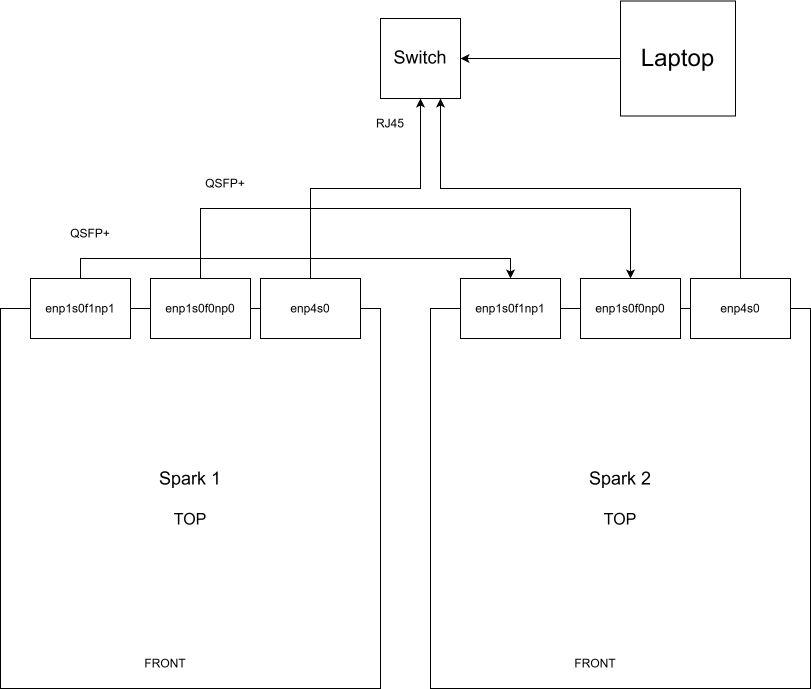

Presenter's Pre-Demo Inventory and Setup Checklist

I. Hardware and Physical Inventory (check when secured for the demo)

 - [] DGX Spark 1
 - [] DGX Spark 2
 - [] QSFP x 2
 - [] Power supplies
	Take from OAI Infra with sparks
 - [] Mouse/Keyboard/Monitor
To be provided by allbesmart - secure the peripherals
 - [] Small ethernet switch + 3x RJ45 cable
 - [] Laptop - take a powerful laptop with GPU if possible

II. Software

 - [] DGX Spark 1 realtime config
 - [] DGX Spark 2 realtime config
 - [] PTP configuration
 - [] O-DU configuration on Spark 1
Prepare a working configuration for CU + DU or gNB split 7.2 for spark 1
 - [] O-RU configuration for Spark 2
Need to figure out the least amount of spark CPUs that the O-RU can run with
 - [] NR UE configuration for Spark 2
Need to figure out the least amount of spark CPUs that the UE can run with
 - [] GPU acceleration on spark 2 
	Verify vrtsim acceleration on spark 2. Check timings using the benchmark provided in the repo
 - [] Configure core network on spark 1 or laptop

III. Demo procedure - basic test

1. Start 1x1 O-RU on Spark 2
2. Start 1x1 O-DU/gNB on Spark 1
3. Start 1x1 NR UE on Spark 2
4. Bidirectional ping
5. Bidirectional Iperf - limit throughput to match CPU limitations

IV. Demo procedure - ambitions
1. Add LDPC acceleration on both sparks (spark 1 for gNB, spark 2 for UE)
2. Add channel-emulation-server on the laptop with the Godot client to showcase real-time channel modifications. This requires a dedicated graphics card.
3. Increase the number of antennas to 2x2
