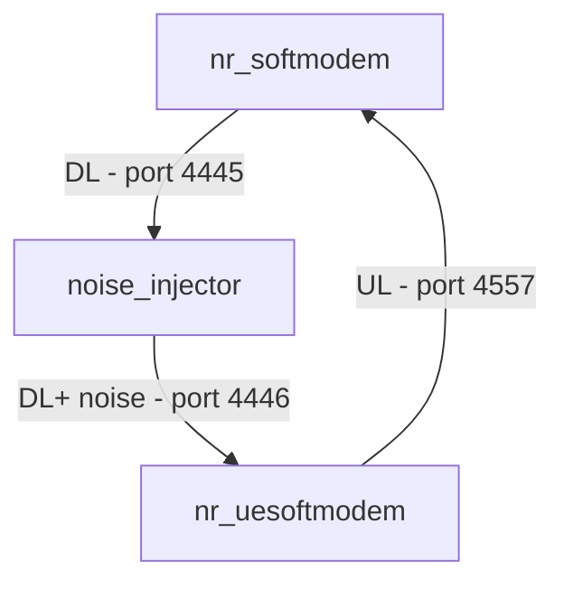

# ZMQ Radio Tutorial

This tutorial provides instructions on how to use the ZeroMQ (ZMQ) radio implementation in OpenAirInterface. The ZMQ
radio allows for simulating the radio link over a network using ZMQ sockets, which is useful for development, testing,
and CI/CD without the need for physical SDR hardware.

It currently supports two main scenarios:
1. Connecting an **OAI gNB** with an **OAI NR UE**.
2. Connecting an **OCUDU gNB** (Split 8) with an **OAI NR UE**.
3. Using GNU Radio companion to inject noise in DL between **OAI gNB** and **OAI NR UE**.

## Prerequisites

Before starting, ensure you have the following dependencies installed on your system:

- **ZeroMQ development libraries**:
  ```bash
  sudo apt-get install libzmq3-dev
  ```
- **OAI Dependencies**: Ensure you have followed the standard OAI build instructions to install necessary system
  dependencies.


## Compilation

To use the ZMQ radio, you need to build the `oai_zmqdevif` library along with the softmodems.

Configure the build:

```bash
cmake ../ -DOAI_ZMQ=ON
```

Compile:

```bash
cmake --build . --target nr-softmodem nr-uesoftmodem ldpc params_libconfig zmq_radio
```

## Scenario 1: OAI gNB <-> OAI NR UE

In this scenario, both the gNB and the UE are running OAI code and communicate over ZMQ.

### 1. Start the gNB

Run the gNB with the `oai_zmqdevif` device name. Note the mapping of TX/RX ports.

```bash
sudo ./nr-softmodem -O ../targets/PROJECTS/GENERIC-NR-5GC/CONF/gnb.sa.band78.fr1.106PRB.usrpb210.conf --gNBs.[0].min_rxtxtime 6 --device.name oai_zmqdevif --zmq.[0].tx_channels tcp://127.0.0.1:4556 --zmq.[0].rx_channels tcp://127.0.0.1:4557
```

### 2. Start the UE

Start the UE and connect it to the ports exposed by the gNB. Note that the UE's TX port should match the gNB's RX port,
and vice versa.

```bash
sudo ./nr-uesoftmodem -r 106 --numerology 1 --band 78 -C 3619200000 --ssb 516 --device.name oai_zmqdevif --zmq.[0].tx_channels tcp://127.0.0.1:4557 --zmq.[0].rx_channels tcp://127.0.0.1:4556
```

## Scenario 2: OCUDU gNB (Split 8) <-> OAI NR UE

This scenario demonstrates interoperability between the OCUDU project's Split 8 gNB and the OAI NR UE.

### 1. Start the Core Network

Deploy the OAI 5G Core Network using Docker Compose.

```bash
cd doc/tutorial_resources/oai-cn5g
docker compose up -d
```

### 2. Configure and Start OCUDU gNB

Create a `config.yml` in your OCUDU directory with the following content:

```yaml
cu_cp:
  amf:
    addrs: 192.168.70.132
    port: 38412
    bind_addrs: 0.0.0.0
    supported_tracking_areas:
      - tac: 1
        plmn_list:
          - plmn: "00101"
            tai_slice_support_list:
              - sst: 1

ru_sdr:
  device_driver: zmq
  device_args: tx_port=tcp://127.0.0.1:4558,rx_port=tcp://127.0.0.1:4556
  srate: 23.04
  tx_gain: 25
  rx_gain: 25

cell_cfg:
  dl_arfcn: 632628
  band: 78
  channel_bandwidth_MHz: 20
  common_scs: 30
  plmn: "00101"
  tac: 1
  pci: 1
  tdd_ul_dl_cfg:
    dl_ul_tx_period: 5
    nof_dl_slots: 3
    nof_dl_symbols: 10
    nof_ul_slots: 1
    nof_ul_symbols: 2
  csi:
    csi_rs_enabled: false
  pucch:
    formats: f0_and_f2
    nof_cell_csi_res: 0

log:
  filename: gnb.log
  all_level: debug

pcap:
  mac_enable: false
  mac_filename: /tmp/gnb_mac.pcap
  ngap_enable: false
  ngap_filename: /tmp/gnb_ngap.pcap
```

Run the OCUDU gNB:

```bash
sudo ./apps/gnb_split_8/gnb -c config.yml
```

### 3. Start OAI NR UE

Connect the OAI NR UE to the OCUDU gNB via ZMQ.

```
sudo ./nr-uesoftmodem -r 51 -E  --numerology 1 --band 78 -C 3489420000 --ssb 0 --uecap_file ../targets/PROJECTS/GENERIC-NR-5GC/CONF/uecap_ports1.xml  --log_config.global_log_options level,nocolor,time --device.name oai_zmqdevif --zmq.[0].tx_channels tcp://127.0.0.1:4556 --zmq.[0].rx_channels tcp://127.0.0.1:4558 -O ../ci-scripts/conf_files/nrue.uicc.conf --uicc0.imsi 001010000000001
```

> Once connected, you can perform standard network tests like `ping` or `iperf` between the UE and the core network.

## Scenario 3: Inject noise using GNU radio companion

In this scenario, you can inject noise between OAI gNB and OAI NR UE. An example GNU radio companion project
is added in `noise_injector.grc`. The program expects a ZMQ radio stream at tcp://127.0.0.1:4445 and outputs the
 same samples with added noise at tcp://127.0.0.1:4446

Architecture


### 1. Start the gNB

```
sudo ./nr-softmodem -O ../targets/PROJECTS/GENERIC-NR-5GC/CONF/gnb.sa.band78.fr1.106PRB.usrpb210.conf --gNBs.[0].min_rxtxtime 6 --device.name oai_zmqdevif --zmq.[0].tx_channels tcp://127.0.0.1:4445 --zmq.[0].rx_channels tcp://127.0.0.1:4557
```

### 2. Start the UE

```
sudo ./nr-uesoftmodem -r 106 --numerology 1 --band 78 -C 3619200000 --ssb 516 --device.name oai_zmqdevif --zmq.[0].tx_channels tcp://127.0.0.1:4557 --zmq.[0].rx_channels tcp://127.0.0.1:4446
```

### 3. Start the GNU radio companion program

You should see a window with an input field labelled noise_amp and a frequency domain waterfall graph of the gNBs
downlink signal.

Now you should be able to change the injected noise and see the UE loose DL connection. Use either the slider
or the input field to change noise amplitude.
