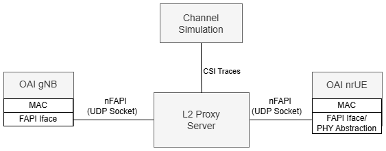
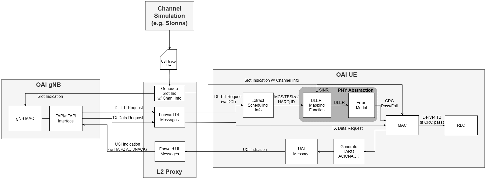

# OAI L2 FAPI Proxy

## Table of Contents

- [Overview](#overview)
- [Architecture](#architecture)
- [Directory Structure](#directory-structure)
- [Setup Instructions](#setup-instructions)
  - [1. Environment Setup](#1-environment-setup)
  - [2. Container Image Building](#2-container-image-building)
  - [3. Core Network Deployment](#3-core-network-deployment)
  - [4. RAN Components Deployment](#4-ran-components-deployment)
  - [5. Runtime Execution](#5-runtime-execution)
  - [6. Verification](#6-verification)
- [Implementation Notes](#implementation-notes)
- [Contact](#contact)

## Overview

The L2 FAPI Proxy enables large-scale multi-UE simulation by providing Layer 2 (MAC-to-MAC) communication between OAI gNB and UE instances. By replacing PHY waveform processing with link-level abstraction models, it allows testing L2+ protocols without physical layer processing or radio hardware.

### Standard nFAPI Architecture

In standard OAI nFAPI split architecture, the Virtual Network Function (VNF) running the L2+ stack communicates with the Physical Network Function (PNF) running L1 over the FAPI interface. When this communication occurs over network sockets, the nFAPI protocol is used.

### L2 Proxy Mode

In L2 Proxy mode:
- **gNB** runs as VNF (`--nfapi VNF`) with L2+ stack only, no PHY processing
- **UE** runs in STANDALONE_PNF mode (`--nfapi STANDALONE_PNF`) with L2+ stack only, no actual PHY
- **L2 Proxy** acts as a virtual PHY layer between them, forwarding nFAPI messages and applying PHY abstraction models

The proxy replaces actual waveform-level PHY processing with link-level abstraction and optional channel simulation.

### Key Features

- **Multi-UE Support**: Simultaneous connection of multiple UE instances
- **PHY Abstraction**: Link-level models replace waveform processing
- **Channel Simulation**: Optional trace-based channel modeling
- **Kubernetes Native**: Designed for containerized deployments
- **Independent Module**: Standalone build system, no core OAI modifications

## Architecture

The L2 FAPI Proxy is a separate module with an independent build system that does not modify core OAI gNB or UE source code. It communicates via standard nFAPI sockets.

### Basic Architecture



### Detailed Simulation Flow



## Directory Structure

```
l2-fapi-proxy/
├── open-nFAPI/          # nFAPI library (P5/P7 interfaces)
│   ├── nfapi/           # Core nFAPI message definitions
│   ├── fapi/            # FAPI-specific implementations
│   ├── pnf/             # PNF-side handling
│   ├── vnf/             # VNF-side handling
│   └── ...
├── src/                 # L2 Proxy implementation
│   ├── proxy.cc         # Main entry point
│   ├── nr_proxy.cc      # NR-specific proxy logic
│   ├── nfapi_pnf.c      # PNF interface implementation
│   ├── run_l2_proxy.sh  # Kubernetes deployment helper
│   └── ...
├── common/              # Common platform utilities
├── helm-charts/         # Kubernetes deployment charts
├── docker/              # Container configurations
├── build/               # Build artifacts (generated)
└── Makefile             # Standalone build system
```

## Setup Instructions

### 1. Environment Setup

#### 1.1 Install Prerequisites

```bash
# Install Docker CE
# Follow: https://docs.docker.com/engine/install/ubuntu/
sudo usermod -aG docker $USER
# Log out and back in for group changes to take effect

# Verify Docker access
docker ps

# Install Kubernetes (K3s recommended) and Helm
# Follow distribution-specific instructions
```

#### 1.2 Clone OAI RAN Repository

```bash
git clone https://gitlab.eurecom.fr/oai/openairinterface5g.git
cd openairinterface5g
git checkout develop

# Save this absolute path for helm chart configuration
pwd
# Example output: /home/username/openairinterface5g
```

Note: Save your OAI directory path. You will configure it in helm chart values files as `oaiCodePath`. All required helm charts are included in `l2-fapi-proxy/helm-charts/`.

#### 1.3 Create Kubernetes Namespace

```bash
kubectl apply -f - <<EOF
apiVersion: v1
kind: Namespace
metadata:
  name: oai
  labels:
    pod-security.kubernetes.io/warn: "privileged"
    pod-security.kubernetes.io/audit: "privileged"
    pod-security.kubernetes.io/enforce: "privileged"
EOF
```

---

### 2. Container Image Building

#### 2.1 Build gNB Development Container Images

```bash
cd openairinterface5g

# Build ran-base-dev image (takes several minutes)
docker build --target ran-base-dev --tag ran-base-dev:latest \
  --file docker/Dockerfile.base.dev.ubuntu22 .

# Build ran-build-dev image
docker build --target ran-build-dev --tag ran-build-dev:latest \
  --file docker/Dockerfile.build.dev.ubuntu22 .

# Build gnb-dev target image
docker build --target oai-gnb-dev --tag oai-gnb-dev:latest \
  --file docker/Dockerfile.gNB.dev.ubuntu22 .

# Verify images
docker images | grep oai-gnb-dev
```

Example output:
```
oai-gnb-dev      latest    abc123def456   2 minutes ago   2.1GB
ran-build-dev    latest    def456ghi789   5 minutes ago   1.8GB
ran-base-dev     latest    ghi789jkl012   8 minutes ago   1.2GB
```

#### 2.2 Import Image into Kubernetes

```bash
# For K3s: Import into local image repository
docker save oai-gnb-dev:latest | sudo k3s ctr images import -

# Confirm import
sudo k3s ctr images ls | grep oai-gnb-dev
```

---

### 3. Core Network Deployment

```bash
cd openairinterface5g/l2-fapi-proxy/helm-charts

# Verify dependencies
helm dependency list oai-5g-basic/
# Should show 10 dependencies (mysql + 9 core network functions), all status: ok

# Build dependencies
helm dependency build oai-5g-basic/

# Install core network
helm install core5g oai-5g-basic/ -n oai

# Verify deployment (wait 2-3 minutes for all pods to be Running)
kubectl get pods -n oai -w
```

What gets deployed: MySQL database + NRF, UDR, UDM, AUSF, AMF, SMF, UPF, LMF, and Traffic Server.

Expected output:
```
NAME                              READY   STATUS    RESTARTS   AGE
mysql-xxx                         1/1     Running   0          2m
oai-amf-xxx                       1/1     Running   0          2m
oai-ausf-xxx                      1/1     Running   0          2m
oai-nrf-xxx                       1/1     Running   0          2m
oai-smf-xxx                       1/1     Running   0          2m
oai-udm-xxx                       1/1     Running   0          2m
oai-udr-xxx                       1/1     Running   0          2m
oai-upf-xxx                       1/1     Running   0          2m
```

---

### 4. RAN Components Deployment

```bash
cd openairinterface5g/l2-fapi-proxy/helm-charts

# Configure gNB - Edit oai-gnb-dev/values.yaml line 87:
#   oaiCodePath: /home/YOUR_USERNAME/openairinterface5g
#
# Example: oaiCodePath: /home/salim/openairinterface5g

# Configure UE - Edit oai-nr-ue-multi/values.yaml line 42:
#   oaiCodePath: /home/YOUR_USERNAME/openairinterface5g
#
# IMPORTANT: oaiCodePath MUST match between gNB and UE configurations

# Validate configurations
helm lint oai-gnb-dev/
helm lint oai-nr-ue-multi/

# Deploy gNB
helm install gnb oai-gnb-dev/ -n oai

# Deploy UEs
helm install ue oai-nr-ue-multi/ -n oai

# Verify RAN deployment (wait 30-60 seconds)
kubectl get pods -n oai | grep -E 'gnb|ue'
```

Expected output:
```
oai-gnb-dev-xxx              1/1     Running   0          45s
oai-nr-ue-multi-00-xxx       1/1     Running   0          30s
```

---

### 5. Runtime Execution

#### 5.1 Build gNB Softmodem

```bash
# Get gNB pod name
GNB_POD=$(kubectl get pods -n oai | grep oai-gnb-dev | awk '{print $1}')

# Enter gNB container
kubectl exec -it $GNB_POD -n oai -- /bin/bash

# Inside container - Install dependencies
cd /opt/oai-ran
/bin/sh oaienv && \
    cd cmake_targets && \
    mkdir -p log && \
    ./build_oai -I --install-optional-packages

# Full build
./build_oai -c -g Debug --ninja \
  --gNB --RU --nrUE \
  --build-lib "telnetsrv uescope nrscope" \
  -t Ethernet \
  --noavx512 \
  --build-tool-opt -k10 \
  --cmake-opt -DCMAKE_C_FLAGS="-Werror" \
  --cmake-opt -DCMAKE_CXX_FLAGS="-Werror"
```

The OAI build system compiles all software components. Resulting executables are placed in `/opt/oai-ran/cmake_targets/ran_build/build/`:
- `nr-softmodem` (gNB executable)
- `nr-uesoftmodem` (NR UE executable)

For incremental rebuilds:
```bash
cd /opt/oai-ran/cmake_targets/ran_build/build
ninja nr-softmodem nr-uesoftmodem
```

#### 5.2 Build L2 Proxy

```bash
# Inside gNB container (new terminal)
kubectl exec -it $GNB_POD -n oai -- /bin/bash

# Build L2 Proxy
cd /opt/oai-ran/l2-fapi-proxy
make clean && make

# Verify build
ls -lh build/proxy
```

Important: Host directory (configured in `oaiCodePath`) is mounted to `/opt/oai-ran` inside container. Build is persistent on host filesystem.

#### 5.3 Start gNB Softmodem

```bash
# Inside gNB container
cd /opt/oai-ran/cmake_targets/ran_build/build

# Run gNB in VNF mode for L2 Proxy
./nr-softmodem -O /tmp/gnb.conf --nfapi VNF
```

**Configuration File**: The `/tmp/gnb.conf` file is dynamically generated when the container starts, based on the helm chart templates (`deployment.yaml` and `configmap.yaml`). Manual changes to `/tmp/gnb.conf` will not persist if the container is recreated.

Expected logs:
```
[GTPU]   Configuring GTPu address : 10.42.0.220, port : 2152
[GTPU]   Initializing UDP for local address 10.42.0.220 with port 2152
[NGAP]   Received NGSetupResponse from AMF
[VNF]    Sent NFAPI_VNF_CONFIG_REQ num_tlv:131
```

#### 5.4 Start L2 Proxy Server

```bash
# Inside gNB container (new terminal)
kubectl exec -it $GNB_POD -n oai -- /bin/bash

cd /opt/oai-ran/l2-fapi-proxy

# Use script (automatically discovers K3s CNI IP addresses)
./src/run_l2_proxy.sh <NUM_GNB> <NUM_UE> [CH_TRACE_FILE]

# Example for 1 gNB, 2 UEs, no channel traces:
./src/run_l2_proxy.sh 1 2

# Alternative: Run directly with explicit IP addresses
./build/proxy --gnb <GNB_IP> --proxy <PROXY_IP> --ue <UE0_IP> <UE1_IP> ...
```

Expected logs:
```
RUNNING pack_param_response
[PNF] vnf p7 0.1.4.0:50611
```

Error messages such as the following are normal before UE connects:
```
[E] nr_config_request: NFAPI_NR_CONFIG_DL_BANDWIDTH_TAG N_RB_DL:40
[E] pnf_p7_send_message: sendto failed errno: 88
[E] pnf_connect: After connect errno: 111
```

#### 5.5 Start UE Softmodem Instances

```bash
# List UE pods
kubectl get pods -n oai | grep oai-nr-ue-multi

# For UE 00:
kubectl exec -it oai-nr-ue-multi-00-<pod-id> -n oai -- /bin/bash

# Inside UE container:
/opt/oai-ran/cmake_targets/ran_build/build/nr-uesoftmodem \
  -O /tmp/nr-ue.conf \
  --nfapi STANDALONE_PNF \
  --node-number 2 \
  --emulate-l1 \
  -r 106 \
  --numerology 1 \
  -C 3619200000
```

**Configuration File**: The `/tmp/nr-ue.conf` file is dynamically generated when the container starts based on helm chart templates. Example configuration:

```
Active_gNBs = ("gNB-OAI");

tracking_area_code = 1;

plmn_list = ({
  mcc = 001;
  mnc = 01;
  mnc_length = 2;
  snssaiList = ({ sst = 1; sd = 0xffffff; });
});

nr_cellid = 12345678L;

uicc0 = {
  imsi = "001010000000100";
  key = "fec86ba6eb707ed08905757b1bb44b8f";
  opc = "C42449363BBAD02B66D16BC975D77CC1";
  dnn = "oai";
  nssai_sst = "1";
  nssai_sd = "16777215";
}

MACRLCs = ({
  num_cc = 1;
  tr_n_preference = "nfapi";
  local_n_if_name = "eth0:";
  remote_n_address = "10.42.0.222";
  local_n_address = "10.42.0.221";
  local_n_portc = 50600;
  remote_n_portc = 50601;
  local_n_portd = 50610;
  remote_n_portd = 50611;
});
```

**Important Parameters**:
- `-O /tmp/nr-ue.conf`: UE configuration file (auto-generated from helm chart)
- `--nfapi STANDALONE_PNF`: L2-only mode (no real PHY), communicates with L2 Proxy
- `--emulate-l1`: Enables L1 emulation required for L2 Proxy
- `--node-number`: Must be `2 + UE_ID` (UE 00 → 2, UE 01 → 3, etc.) for unique identification

For multiple UEs, repeat for each UE pod, incrementing `--node-number` accordingly.

Expected UE logs:
```
[MAC]   [UE 0][109.0][RAPROC] 4-Step RA procedure succeeded. CBRA: Contention Resolution is successful.
[NAS]   Received Registration Accept with result 3GPP
[NAS]   Received PDU Session Establishment Accept, UE IPv4: 12.1.1.100
```

After successful attach, the `oaitun_ue1` interface should be present with IP address `12.1.1.x` and can ping the UPF at `12.1.1.1`.

---

### 6. Verification

#### 6.1 Check Synchronization Status

gNB should show:
```
[GTPU] Configuring GTPu address : 10.42.0.220, port : 2152
[NGAP] Received NGSetupResponse from AMF
[VNF] Sent NFAPI_VNF_CONFIG_REQ num_tlv:131
[NR_MAC] Frame.Slot 128.0 ...
```

L2 Proxy should show:
```
RUNNING pack_param_response
[PNF] vnf p7 0.1.4.0:50611
```

#### 6.2 Common Commands

```bash
# View all pods
kubectl get pods -n oai

# View logs
kubectl logs <POD_NAME> -n oai

# Follow logs in real-time
kubectl logs -f <POD_NAME> -n oai

# Enter container shell
kubectl exec -it <POD_NAME> -n oai -- /bin/bash

# List Helm releases
helm list -n oai

# Uninstall Helm release
helm uninstall <RELEASE_NAME> -n oai
```

---

## Implementation Notes

### Technical Details

- **Origin**: Derived from the EpiSci multi-UE proxy project
- **nFAPI Mode**:
  - gNB runs with `--nfapi VNF` (L2+ stack without PHY)
  - UE runs with `--nfapi STANDALONE_PNF --emulate-l1` (L2+ stack with emulated L1)
  - Proxy implements both VNF and PNF interfaces to bridge between them
- **FAPI Implementation**: The `open-nFAPI` directory contains modified copies of FAPI interface files from OAI's top-level `nfapi` directory
- **Build System**: Uses standalone Makefile, not integrated with OAI CMake build system
- **Deployment**: Runs inside the gNB container in Kubernetes deployments
- **Startup Order**: gNB and L2 Proxy can be started in any order, but logically start gNB first
- **Network Ports**:
  - nFAPI P5 (configuration): 50600-50601
  - nFAPI P7 (data plane): 50610-50611

### Architecture Considerations

- **Scalability**: Supports multiple UEs (tested with 50+ concurrent UEs)
- **Flexibility**: Optional channel trace injection for realistic scenarios

---

## Contact

For questions, issues, or contributions related to the L2 FAPI Proxy:

- **Russell Ford**: russelldford@gmail.com
- **Daoud Burghal**: d.burghal@samsung.com
- **Pranav Madadi**: p.madadi@samsung.com
- **Salim El Ghalbzouri**: s.elghalbzo@partner.samsung.com / salim.elghalb@gmail.com

---
