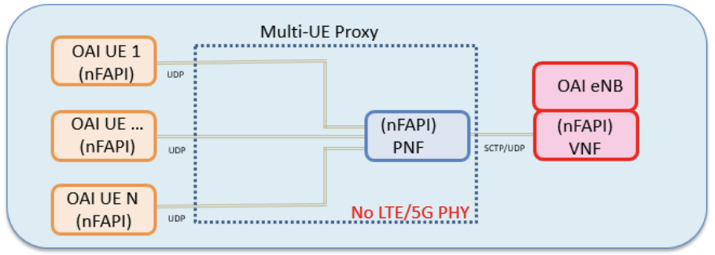
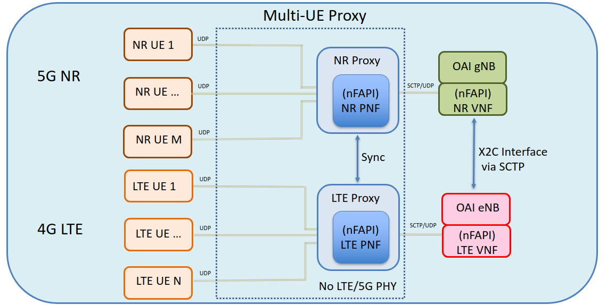
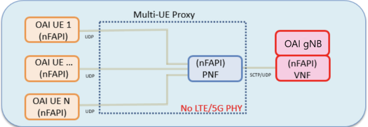

# OAI L2 FAPI Proxy

## Table of Contents

- [Overview](#overview)
- [Architecture](#architecture)
- [Quick Start Guide](#quick-start-guide)
- [Detailed Setup Instructions](#detailed-setup-instructions)
  - [Phase 1: Environment Setup](#phase-1-environment-setup)
  - [Phase 2: Container Image Building](#phase-2-container-image-building)
  - [Phase 3: Core Network Deployment](#phase-3-core-network-deployment)
  - [Phase 4: RAN Components Deployment](#phase-4-ran-components-deployment)
  - [Phase 5: Runtime Execution](#phase-5-runtime-execution)
  - [Phase 6: Verification and Troubleshooting](#phase-6-verification-and-troubleshooting)
- [Alternative Modes](#alternative-modes)
- [Clean-up Procedures](#clean-up-procedures)
- [Contact](#contact)

## Overview

The L2 FAPI Proxy enables large-scale multi-UE simulation by providing Layer 2 (MAC-to-MAC) communication between OAI gNB and UE instances. By replacing PHY waveform processing with link-level abstraction models, it allows testing L2+ protocols without physical layer processing or radio hardware.

### Standard nFAPI Architecture

In standard OAI nFAPI split architecture, the Virtual Network Function (VNF) running L2+ stack communicates with the Physical Network Function (PNF) running L1 over the FAPI interface. When this communication occurs over network sockets, the nFAPI protocol is used.

### L2 Proxy Mode

In L2 Proxy mode:
- **gNB** runs as VNF (`--nfapi VNF`) with L2+ stack only, no PHY processing
- **UE** runs in STANDALONE_PNF mode (`--nfapi STANDALONE_PNF`) with L2+ stack only, no actual PHY
- **L2 Proxy** acts as a virtual PHY layer between them, forwarding nFAPI messages and applying PHY abstraction models

The proxy replaces actual waveform-level PHY processing with link-level abstraction and optional channel simulation.

```
┌─────────────┐    nFAPI (UDP)    ┌──────────────┐    nFAPI (UDP)   ┌─────────────┐
│   gNB VNF   │◄─────────────────►│  L2 Proxy    │◄────────────────►│   UE L2     │
│   (L2+)     │                   │   Server     │                  │   (L2+)     │
│  --nfapi    │                   │              │                  │  --nfapi    │
│    VNF      │                   │              │                  │STANDALONE_PNF│
└─────────────┘                   └──────────────┘                  └─────────────┘
                                        │
                                        ├─ PHY Abstraction
                                        ├─ Channel Simulation (optional)
                                        └─ CSI Trace Injection (optional)
```

The proxy implements nFAPI P5 (configuration) and P7 (slot-based messaging) interfaces, supports multiple UE connections, and replaces waveform-level PHY processing with link-level abstraction models.

### Key Features

- **Multi-UE Support**: Simultaneous connection of multiple UE instances
- **PHY Abstraction**: Link-level models replace waveform processing
- **Channel Simulation**: Optional trace-based channel modeling
- **Kubernetes Native**: Designed for containerized deployments
- **Independent Module**: Standalone build system, no core OAI modifications

### Supported Modes

The L2 FAPI Proxy supports three operational modes:

#### LTE Mode
In LTE mode, the proxy enables multi-UE simulation with LTE eNB:



#### NSA (Non-Standalone) Mode
In NSA mode, the proxy coordinates both LTE eNB and NR gNB for dual connectivity scenarios:



#### SA (Standalone) Mode
In SA/NR mode, the proxy enables multi-UE simulation with 5G NR gNB only:



## Architecture

This is a separate module with an independent build system that does not modify core OAI gNB or UE source code. It communicates via standard nFAPI sockets.

## Directory Structure

```
l2-fapi-proxy/
├── open-nFAPI/          # nFAPI library (P4/P5/P7 interfaces)
│   ├── nfapi/           # Message definitions and encode/decode
│   ├── fapi/            # NR FAPI primitives  
│   ├── pnf/             # PNF-side implementation
│   └── common/          # Utilities and debug functions
├── src/                 # Proxy implementation
│   ├── proxy.cc         # Main entry point
│   ├── nr_proxy.cc      # NR proxy logic
│   ├── lte_proxy.cc     # LTE proxy support
│   ├── nfapi_pnf.c      # PNF interface handling
│   ├── nfapiutils.c     # Utility functions
│   ├── queue.c          # Message queue
│   └── run_l2_proxy.sh  # Deployment script for Kubernetes
├── common/              # Common utilities
├── build/               # Build output
│   └── proxy            # Compiled executable
├── Makefile             # Standalone build system (not CMake)
└── README.md
```

## Quick Start Guide

### 🚀 Recommended Deployment Path

**For most users, follow this streamlined path:**

1. **Prerequisites**: Install Docker, Kubernetes (K3s recommended), and Helm
2. **Clone**: `git clone https://gitlab.eurecom.fr/oai/openairinterface5g.git`
3. **Build Images**: Create Docker images for gNB/UE containers (see Phase 2)
4. **Configure**: Set `oaiCodePath` in helm chart values to your OAI directory path
5. **Deploy**: Install core network, gNB, and UE using helm charts
6. **Execute**: Build and run L2 Proxy → gNB → UE softmodems inside containers

**Why this approach?**
- ✅ All 13 helm charts self-contained in `l2-fapi-proxy/helm-charts/`
- ✅ No separate repository clones needed (except OAI RAN itself)
- ✅ Production-tested configuration
- ✅ Detailed troubleshooting guide available

### Alternative Deployment Options

This repository supports **two deployment methods**:

| Option | Description | Best For | Documentation |
|--------|-------------|----------|---------------|
| **A: Self-Contained Helm Charts** | All dependencies included in `helm-charts/` | Production deployments, first-time users | [helm-charts/README.md](helm-charts/README.md) |
| **B: Manual/External Charts** | Use external OAI CN5G charts | Advanced customization, integration testing | Instructions below |

---

> **⚠️ RECOMMENDED**: Use **Option A** for the smoothest experience. Option B below is for advanced scenarios requiring custom core network configurations.

---

## Detailed Setup Instructions

### Phase 1: Environment Setup

#### 1.1 Install Prerequisites

```bash
# Install Docker CE
# Follow: https://docs.docker.com/engine/install/ubuntu/ (Apt option)
sudo usermod -aG docker $USER
# Log out and back in for group changes to take effect
docker ps  # Test sudoless access

# Install Kubernetes (K3s recommended) and Helm
# Follow your distribution-specific instructions
```

#### 1.2 Clone OAI RAN Repository

```bash
# Clone OAI RAN repository (contains L2 FAPI Proxy)
git clone https://gitlab.eurecom.fr/oai/openairinterface5g.git
cd openairinterface5g
git checkout develop

# Remember this absolute path - you'll need it later:
pwd
# Example output: /home/salim/openairinterface5g
```

**📝 Note**: Save your OAI directory path! You'll configure it in helm chart values files as `oaiCodePath`.

**💡 Tip**: If using **Option A** (self-contained helm charts - RECOMMENDED), you do NOT need to clone `oai-cn5g-fed`. All required charts are included in `l2-fapi-proxy/helm-charts/` (13 charts: mysql + oai-5g-basic + 9 core network functions + oai-gnb-dev + oai-nr-ue-multi).

#### 1.3 Create Kubernetes Namespace

```bash
kubectl apply -f - <<EOF
apiVersion: v1
kind: Namespace
metadata:
  name: oai
  labels:
    pod-security.kubernetes.io/warn: "privileged"
    pod-security.kubernetes.io/audit: "privileged"
    pod-security.kubernetes.io/enforce: "privileged"
EOF
```

---

### Phase 2: Container Image Building

#### 2.1 Build gNB Development Container Images

```bash
cd openairinterface5g

# Build ran-base-dev image (takes several minutes)
docker build --target ran-base-dev --tag ran-base-dev:latest \
  --file docker/Dockerfile.base.dev.ubuntu22 .

# Build ran-build-dev image
docker build --target ran-build-dev --tag ran-build-dev:latest \
  --file docker/Dockerfile.build.dev.ubuntu22 .

# Build gnb-dev target image
docker build --target oai-gnb-dev --tag oai-gnb-dev:latest \
  --file docker/Dockerfile.gNB.dev.ubuntu22 .

# Verify image was created
docker images | grep oai-gnb-dev
```

**Optional**: Save and load images for transfer:
```bash
# Save image to file
docker save ran-base-dev:latest -o ran-base-dev.tar

# Load image from file
docker load -i ran-base-dev.tar
```

#### 2.2 Import Image into Kubernetes

```bash
# For K3s: Save and import into local image repo
docker save oai-gnb-dev:latest | sudo k3s ctr images import -

# Confirm import
sudo k3s ctr images ls | grep oai-gnb-dev
```

---

### Phase 3: Core Network Deployment

#### Option A: Using Self-Contained Charts (Recommended)

```bash
cd openairinterface5g/l2-fapi-proxy/helm-charts

# Verify all dependencies are present
helm dependency list oai-5g-basic/
# Should show 10 dependencies (mysql + 9 core network functions), all status: ok

# Build dependencies (first time only)
helm dependency build oai-5g-basic/

# Install core network
helm install core5g oai-5g-basic/ -n oai

# Verify deployment (wait ~2-3 minutes for all pods to be Running)
kubectl get pods -n oai -w
```

**What gets deployed**: MySQL database + NRF, UDR, UDM, AUSF, AMF, SMF, UPF, LMF, and Traffic Server

#### Option B: Using External CN5G Charts

```bash
cd oai-cn5g-fed/charts

# Build dependencies (first time only)
helm dependency build oai-5g-core/oai-5g-basic

# Install core network
helm install basic oai-5g-core/oai-5g-basic/ -n oai
```

#### 3.2 Verify Core Network Deployment

```bash
# Check pod status (wait 2-3 minutes for all to be "Running")
kubectl get pods -n oai

# Expected output: 10 pods (mysql + nrf + udr + udm + ausf + amf + smf + upf + lmf + traffic-server)
# All should show STATUS: Running, READY: 1/1

# Check Helm release
helm list -n oai
# Expected: NAME=core5g, STATUS=deployed

# View logs if troubleshooting needed
kubectl logs <POD_NAME> -n oai -f
```

---

### Phase 4: RAN Components Deployment

#### Option A: Using Self-Contained Charts (Recommended)

```bash
cd openairinterface5g/l2-fapi-proxy/helm-charts

# STEP 1: Configure gNB
# Edit oai-gnb-dev/values.yaml line 87:
#    oaiCodePath: /home/YOUR_ACTUAL_USERNAME/openairinterface5g
#
# Example: oaiCodePath: /home/salim/openairinterface5g

# STEP 2: Configure UE
# Edit oai-nr-ue-multi/values.yaml:
#    Line 3:  ueIds: ["00", "01", "02"]  # Customize number of UEs (default: ["00"])
#    Line 42: oaiCodePath: /home/YOUR_ACTUAL_USERNAME/openairinterface5g
#
# ⚠️ IMPORTANT: oaiCodePath MUST match between gNB and UE configurations

# STEP 3: Validate configurations
helm lint oai-gnb-dev/
helm lint oai-nr-ue-multi/

# STEP 4: Deploy gNB
helm install gnb oai-gnb-dev/ -n oai

# STEP 5: Deploy UEs
helm install ue oai-nr-ue-multi/ -n oai

# STEP 6: Verify RAN deployment (wait 30-60 seconds)
kubectl get pods -n oai | grep -E 'gnb|ue'
# Expected output: oai-gnb-dev-xxx (1/1 Running) and oai-nr-ue-multi-ue-XX-xxx (1/1 Running) pods
```

**📖 For detailed configuration options and troubleshooting, see [helm-charts/README.md](helm-charts/README.md)**

#### Option B: Using External Charts

```bash
cd oai-cn5g-fed/charts/oai-5g-ran

# Edit values.yaml files and deploy as per external documentation
-
helm install ue oai-nr-ue-multi/ -n oai
```

---

### Phase 5: Runtime Execution

#### 5.1 Build L2 Proxy

```bash
# Get gNB pod name
GNB_POD=$(kubectl get pods -n oai | grep oai-gnb-dev | awk '{print $1}')
echo "gNB Pod: $GNB_POD"

# Enter gNB container
kubectl exec -it $GNB_POD -n oai -- /bin/bash

# Inside container - Build L2 Proxy
cd /opt/oai-ran/l2-fapi-proxy
make clean && make

# Verify build
ls -lh build/proxy
```

**📝 Important Notes**:
- Host directory (configured in `oaiCodePath`) is mounted to `/opt/oai-ran` inside container
- Build output: `/opt/oai-ran/l2-fapi-proxy/build/proxy`
- Build is persistent on host filesystem (survives pod restarts)

#### 5.2 Build gNB Softmodem

**Important**: The OAI build system compiles all software components. The resulting executables are placed in `/opt/oai-ran/cmake_targets/ran_build/build/`, including the main ones:
- `nr-softmodem` (gNB executable)
- `nr-uesoftmodem` (NR UE executable)

##### Initial Build (First Time)

```bash
# Inside gNB container
cd /opt/oai-ran

# Install dependencies
/bin/sh oaienv && \
    cd cmake_targets && \
    mkdir -p log && \
    ./build_oai -I --install-optional-packages

# Full build (remove '-g Debug' for non-debug builds)
./build_oai -c -g Debug --ninja \
  --gNB --RU --nrUE \
  --build-lib "telnetsrv uescope nrscope" \
  -t Ethernet \
  --noavx512 \
  --build-tool-opt -k10 \
  --cmake-opt -DCMAKE_C_FLAGS="-Werror" \
  --cmake-opt -DCMAKE_CXX_FLAGS="-Werror" && \
echo "---- ldd on executables ----" && \
ldd ran_build/build/*softmodem* && \
echo "---- ldd on shared libraries ----" && \
ldd ran_build/build/*.so
```

**When to use**: First build, after major updates, or when troubleshooting dependency issues

##### Incremental Builds (Subsequent Builds)

For faster rebuilds during development:

```bash
# From inside the build directory
cd /opt/oai-ran/cmake_targets/ran_build/build

# Incremental build using ninja
ninja nr-softmodem nr-uesoftmodem
```

**When to use**: Quick rebuilds during development after modifying source files

#### 5.3 Start L2 Proxy Server

```bash
# Inside gNB container (new terminal)
cd /opt/oai-ran/l2-fapi-proxy

# Option 1: Use script (recommended)
./src/run_l2_proxy.sh <NUM_GNB> <NUM_UE> [CH_TRACE_FILE]
# Example: ./src/run_l2_proxy.sh 1 2

# Option 2: Run directly with IP addresses
./build/proxy --gnb <GNB_IP> --proxy <PROXY_IP> --ue <UE_IP>...
```

**Expected logs**:
```
RUNNING pack_param_response
[PNF] vnf p7 0.1.4.0:50611
```

#### 5.4 Start gNB Softmodem

```bash
# Inside gNB container (original terminal)
cd /opt/oai-ran/cmake_targets/ran_build/build

# Run gNB in VNF mode for L2 Proxy
./nr-softmodem -O /tmp/gnb.conf --nfapi VNF
```

**Expected logs**:
```
[GTPU]   Configuring GTPu address : 10.42.0.220, port : 2152
[NGAP]   Received NGSetupResponse from AMF
[VNF]    Sent NFAPI_VNF_CONFIG_REQ num_tlv:131
[NR_MAC] Frame.Slot 128.0 ...
```

#### 5.5 Start UE Softmodem Instances

**Get UE pod names and exec into each**:
```bash
# List UE pods
kubectl get pods -n oai | grep oai-nr-ue-multi

# For UE 00:
kubectl exec -it oai-nr-ue-multi-ue-00-<pod-id> -n oai -- /bin/bash

# Inside UE container:
/opt/oai-ran/cmake_targets/ran_build/build/nr-uesoftmodem \
  -O /tmp/nr-ue.conf \
  --nfapi STANDALONE_PNF \
  --node-number 2 \
  --emulate-l1 \
  -r 106 \
  --numerology 1 \
  -C 3619200000
```

**Important Parameter Explanations**:
- `--nfapi STANDALONE_PNF`: L2-only mode (no real PHY), communicates with L2 Proxy
- `--emulate-l1`: Enables L1 emulation required for L2 Proxy
- `--node-number`: Must be `2 + UE_ID` (UE 00 → 2, UE 01 → 3, etc.) for unique identification

**For multiple UEs**: Repeat for each UE pod, incrementing `--node-number` accordingly

**Expected UE logs**:
```
[MAC]   [UE 0][RAPROC] 4-Step RA procedure succeeded. CBRA: Contention Resolution is successful.
[NAS]   Received Registration Accept with result 3GPP
[NAS]   Received PDU Session Establishment Accept, UE IPv4: 12.1.1.100
```

After attach, the `oaitun_ue1` interface should have IP `12.1.1.x` and can ping UPF at `12.1.1.1`

---

### Phase 6: Verification and Troubleshooting

#### 6.1 Check Synchronization Status

**gNB should show**:
```
[GTPU] Configuring GTPu address : 10.42.0.220, port : 2152
[NGAP] Received NGSetupResponse from AMF
[VNF] Sent NFAPI_VNF_CONFIG_REQ num_tlv:131
[NR_MAC] Frame.Slot 128.0 ...
```

**L2 Proxy should show**:
```
RUNNING pack_param_response
[PNF] vnf p7 0.1.4.0:50611
```

#### 6.2 Common Commands

```bash
# View all pods
kubectl get pods -n oai

# View logs
kubectl logs <POD_NAME> -n oai

# Follow logs in real-time
kubectl logs -f <POD_NAME> -n oai

# Enter container shell
kubectl exec -it <POD_NAME> -n oai -- /bin/bash

# List Helm charts
helm list -n oai

# Uninstall Helm chart
helm uninstall <CHART_NAME> -n oai
```

#### 6.3 Quick Rebuild Commands

Refer to [Phase 5.1](#51-build-l2-proxy) for L2 Proxy builds and [Phase 5.2](#52-build-gnb-softmodem) for gNB/UE softmodem builds.

---

## Alternative Modes

### RFSIM Mode

If you want to run with RF Simulator instead of L2 Proxy, use the following configurations:

#### For gNB (RFSIM):

```bash
cd /opt/oai-ran/cmake_targets/ran_build/build
./nr-softmodem -O /tmp/gnb.conf --sa --rfsim
```

#### For UE (RFSIM):

```bash
/opt/oai-nr-ue/bin/nr-uesoftmodem \
  -O /opt/oai-nr-ue/etc/nr-ue.conf \
  --rfsimulator.serveraddr $RFSIM_IP_ADDRESS
```

**Note**: RFSIM operates at the PHY waveform level (higher fidelity, higher CPU usage), while L2 Proxy operates at the MAC layer with PHY abstraction (lower CPU usage, better scalability for multi-UE scenarios).

---

## Clean-up Procedures

### Soft Clean-up (Restart Components)

**For Option A (Self-Contained Charts)**:
```bash
helm uninstall ue -n oai
helm uninstall gnb -n oai
helm uninstall core5g -n oai
```

**For Option B (External Charts)**:
```bash
helm uninstall ue -n oai
helm uninstall gnb -n oai
helm uninstall basic -n oai
```

### Complete Clean-up (Fresh Start)

```bash
# 1. Check current state
kubectl get pods -n oai

# 2. Uninstall all Helm charts in namespace
helm list -n oai | awk 'NR>1 {print $1}' | xargs -I {} helm uninstall {} -n oai

# 3. Delete all pods (if any remain)
kubectl delete pods --all -n oai

# 4. Delete namespace (optional - for completely fresh start)
kubectl delete namespace oai

# 5. Recreate namespace if deleted (see Phase 1.3)
```

**Note**: After complete clean-up, you'll need to recreate the namespace and redeploy all components.

### Clean-up Docker Images (Optional)

```bash
# Remove OAI images (if you built them)
docker rmi oai-gnb-dev:latest ran-build-dev:latest ran-base-dev:latest 2>/dev/null || true

# Clean up all unused Docker images and containers
docker system prune -a
```

---

## Implementation Notes

### Technical Details

- **Origin**: Derived from the EpiSci multi-UE proxy project
- **nFAPI Mode**: 
  - gNB runs with `--nfapi VNF` (L2+ stack without PHY)
  - UE runs with `--nfapi STANDALONE_PNF --emulate-l1` (L2+ stack with emulated L1)
  - Proxy implements both VNF and PNF interfaces to bridge between them
- **FAPI Implementation**: The `open-nFAPI` directory contains modified copies of FAPI interface files from OAI's top-level `nfapi` directory
- **Build System**: Uses standalone Makefile, not integrated with OAI CMake build system
- **Deployment**: Typically runs inside the gNB container in Kubernetes deployments
- **Startup Order**: L2 Proxy should be started first, then gNB VNF, then UE instances
- **Network Ports**: 
  - nFAPI P5 (configuration): 50600-50601
  - nFAPI P7 (data plane): 50610-50611

### Architecture Considerations

- **Scalability**: Supports multiple UEs (tested with 50+ concurrent UEs)
- **Flexibility**: Optional channel trace injection for realistic scenarios
- **Debugging**: Extensive logging for protocol-level troubleshooting

---

## Contact

For questions, issues, or contributions related to the L2 FAPI Proxy:

- **Salim El Ghalbzouri**: s.elghalbzo@partner.samsung.com / salim.elghalb@gmail.com
- **Russell Ford**: russelldford@gmail.com
- **Daoud Burghal**: d.burghal@samsung.com
- **Pranav Madadi**: p.madadi@samsung.com

---