# OAI nrLDPC GPU Decoder Architecture

**Author:** PAN Qizhi

## 0. Scope & Supported Configurations

This document describes the architecture and parallelization strategies of the GPU-accelerated LDPC decoder implemented via CUDA. 

> **Note on Algorithm Baseline:** The current CUDA implementation is strictly **bit-exact and algorithm-exact** with the existing OAI [CPU baseline](nrLDPC.tex). It focuses purely on throughput acceleration, hardware offloading, and architectural refactoring. It does not introduce any algorithmic modifications to the underlying error correction mathematical model. Therefore, it is expected to yield the exact same BLER performance as the [CPU baseline](nrLDPC.tex)

### Currently Supported Parameters

| Parameter | Supported Configuration |
| :--- | :--- |
| **Base Graph (BG)** | 1 |
| **Lifting Size (Z)** | ≥ 128 |
| **Code Rate (R)** | 1/3, 2/3, 8/9 |

---

[[_TOC_]]

## 1. Overall Architecture
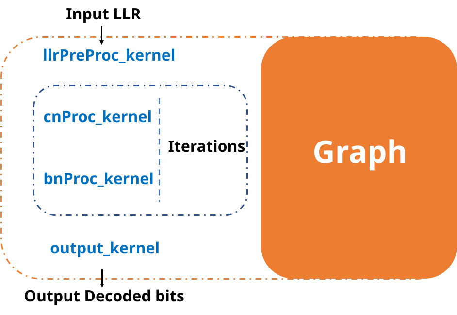

The OAI nrLDPC GPU decoder consists of four main kernels: `llrPreProc_kernel`, `cnProc_kernel`, `bnProc_kernel`, and `output_kernel`. 

Functionally, the GPU version is strictly aligned with the CPU baseline. Each CUDA kernel is essentially a consolidation of multiple specific functions from the CPU decoder. The exact mapping is as follows:

* **`llrPreProc_kernel`**: Combines `llr2llrProcBuf` and `llr2CnProcBuf`.
* **`cnProc_kernel`**: Combines `cnProc` and `cn2bnProcBuf`.
* **`bnProc_kernel`**: Combines `bnProcPc`, `bnProc`, and `bn2cnProcBuf`.
* **`output_kernel`**: Combines `llrRes2llrOut` and `llr2bit`.

## 2. Message Passing in LDPC Decoding

In this section, we briefly describe the behavior of `cnProc` (Check Node processing) and `bnProc` (Bit Node processing) during decoding. This high-level understanding will help clarify the overall parallelism design discussed later.

In LDPC decoding, the task of a Check Node (CN) in `cnProc` is to generate and send update messages to its connected Bit Nodes (BNs). For example, a degree-4 CN (a CN connected to 4 BNs) needs to generate 4 distinct messages—typically using min-sum operations—and send each message back to the corresponding connected BN. Each of these messages corresponds to one edge in the bipartite graph.

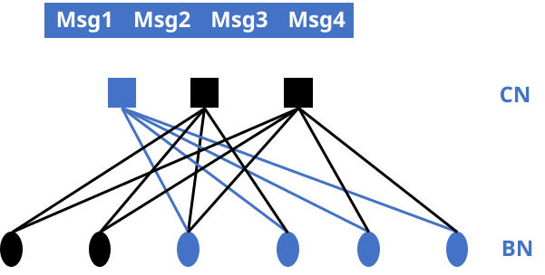

Conversely, the task of a BN in `bnProc` is to gather all the messages from its connected CNs and send updated messages back. This involves accumulation and subtraction operations. For example, a degree-3 BN (a BN connected to 3 CNs) generates 3 messages by first accumulating the 3 incoming messages from the connected CNs along with its original intrinsic LLR, then subtracting each CN's specific value, and sending the newly updated message back to the corresponding CN.

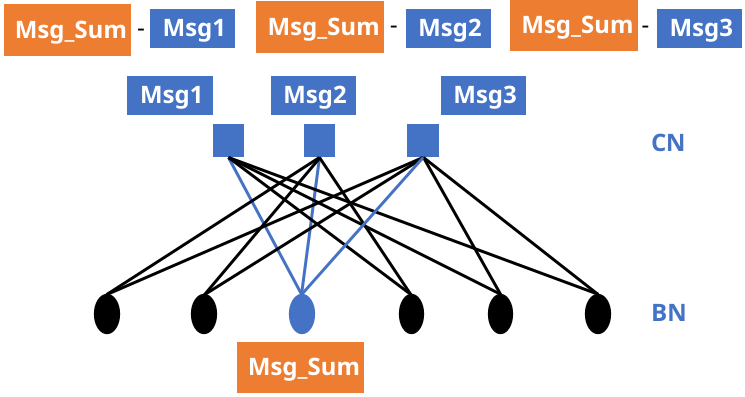

The entire decoding process is executed by iteratively alternating between these two behaviors. 
## 3. Memory Management & Buffer Layout
### 3.1 Memory Management
In the current implementation, all relevant buffers reside entirely in GPU memory (Device memory). By keeping the entire receiver processing pipeline's buffers on the GPU, we completely eliminate the overhead of Host-to-Device (H2D) and Device-to-Host (D2H) memory transfers between individual kernels.

The following table summarizes the key data buffers and their read/write access patterns across the kernels:

| Buffer Name | Description | Written By | Read By |
| :--- | :--- | :--- | :--- |
| `p_llr` | Output from the rate matching module (raw input LLRs). | *(Previous module)* | `llrPreProc_kernel` |
| `p_out` | Final hard-decision decoded output bits. | `output_kernel` | *(Next module)* |
| `cnProcBuf_dev` | Stores BN-to-CN messages. Initialized with intrinsic LLRs before the first iteration. | `llrPreProc_kernel` (init), `bnProc_kernel` | `cnProc_kernel` |
| `bnProcBuf_dev` | Stores CN-to-BN messages updated during check node processing. | `cnProc_kernel` | `bnProc_kernel` |
| `llrRes_dev` | Stores the posterior LLRs (a posteriori information) accumulated during the final iteration. | `bnProc_kernel` (last iter) | `output_kernel` |
| `llrProcBuf_dev` | Stores the rearranged intrinsic LLRs to be added back during BN updates, preventing belief drift. | `llrPreProc_kernel` | `bnProc_kernel` |

### 3.2 Buffer Layout

All buffers here follow the exact same layout as the CPU version, especially the two most critical buffers in the decoding process: `cnProcBuf_dev` and `bnProcBuf_dev`. 

The OAI decoder implementation groups the Check Nodes (CNs) and Bit Nodes (BNs) based on their degree (the number of connected nodes). 
While their layouts are rigorously described using mathematical notation in [`doc/nrLDPC/nrLDPC.tex`](nrLDPC.tex), this section provides a more intuitive description of their structures in memory.

`cnProcBuf_dev` stores the messages that a CN needs to process, which are sent by its connected BNs. For example, a degree-4 CN needs to process 4 incoming messages. However, in the current buffer layout design, these 4 messages belonging to the same CN are **not contiguous** in memory. 

To illustrate, consider BG1 (Rate 1/3), which contains 5 CNs with a degree of 4. The actual memory layout groups the same message index across all CNs in that specific group, as depicted below:

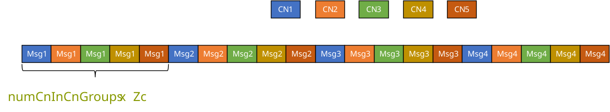

Similarly, `bnProcBuf_dev` follows this exact same interleaved layout strategy.

This specific Structure of Arrays (SoA) interleaving was historically designed to maximize CPU SIMD (e.g., AVX-512) vectorization efficiency. By clustering the same message indices together across multiple CNs, it avoids complex cross-lane shuffles and boundary alignment issues within vector registers. 

For the CUDA implementation, we retain this legacy layout. It imposes no performance penalty on the GPU—since global memory coalescing is already naturally guaranteed by the innermost lifting size ($Z_c$) dimension, and it perfectly fulfills the alignment requirements for the SIMD4 operations used in our GPU implementation.
## 4. Flat Message Indexing

The fundamental computational elements in our LDPC decoder are the individual messages passed along the edges of the bipartite graph (either CN-to-BN or BN-to-CN). To specify their behaviors during parallel decoding, each message must be mapped to a unique memory address, a destination buffer address, and a specific circular shift value.

Instead of relying on nested loops and complex multi-dimensional pointers, we introduce a **Flat Message Indexing** strategy. We assign a deterministic, global 1D index to every single message (edge) in the Base Graph.

### 4.1 Total Message Calculation

The total number of messages is calculated based on the degree distribution of the Check Nodes in BG1. By multiplying the number of connected BNs (`numBnInCnGroups`) with the number of corresponding CNs (`numCnInCnGroups`), we obtain the exact number of edges for each Code Rate (R):

* **Degrees (`numBnInCnGroups`)**: {3, 4, 5, 6, 7, 8, 9, 10, 19}
* **R 1/3 CN Counts**: {1, 5, 18, 8, 5, 2, 2, 1, 4} $\rightarrow$ Total Messages = $3(1) + 4(5) + 5(18) + \dots + 19(4) = \mathbf{316}$
* **R 2/3 CN Counts**: {1, 0, 0, 0, 3, 2, 2, 1, 4} $\rightarrow$ Total Messages = $\mathbf{144}$
* **R 8/9 CN Counts**: {1, 0, 0, 0, 0, 0, 0, 0, 4} $\rightarrow$ Total Messages = $\mathbf{79}$

### 4.2 Linear Index Mapping

By flattening the structure, the messages are linearized sequentially. The 1D index effectively acts as a universal coordinate `(CN/BN_Degree, CN/BN_Instance_ID, Local_Message_ID)`. 

We use the indexing from CN side as an example, the mappings for the supported code rates are as follows:

```text
[Rate 1/3 Message Index Map - Total 316]
Idx 0   : CN3-0-Msg0
Idx 1   : CN3-0-Msg1
Idx 2   : CN3-0-Msg2
Idx 3   : CN4-0-Msg0
Idx 4   : CN4-0-Msg1
Idx 5   : CN4-0-Msg2
Idx 6   : CN4-0-Msg3
Idx 7   : CN4-1-Msg0
...
Idx 314 : CN19-3-Msg17
Idx 315 : CN19-3-Msg18

[Rate 2/3 Message Index Map - Total 144]
Idx 0   : CN3-0-Msg0
Idx 1   : CN3-0-Msg1
Idx 2   : CN3-0-Msg2
Idx 3   : CN7-0-Msg0
Idx 4   : CN7-0-Msg1
Idx 5   : CN7-0-Msg2
Idx 6   : CN7-0-Msg3
Idx 7   : CN7-0-Msg4
...
Idx 142 : CN19-3-Msg17
Idx 143 : CN19-3-Msg18

[Rate 8/9 Message Index Map - Total 79]
Idx 0   : CN3-0-Msg0
Idx 1   : CN3-0-Msg1
Idx 2   : CN3-0-Msg2
Idx 3   : CN19-0-Msg0
Idx 4   : CN19-0-Msg1
Idx 5   : CN19-0-Msg2
Idx 6   : CN19-0-Msg3
Idx 7   : CN19-0-Msg4
...
Idx 77  : CN19-3-Msg17
Idx 78  : CN19-3-Msg18
```
The indexing from BN side follows the same strategy.

This 1D indexing maps to specific offset LUTs, seamlessly guiding the threads to calculate the exact memory addresses on the interleaved buffer layout described in Section 3.2. 

To support other code rates or base graphs in the future (for example, a potential BG3 in 6G), basically, we just need to design new indexings and LUTs accordingly.

## 5. Parallelism Strategies
### 5.1 Edge-Based Parallelism

To extract the maximum concurrency from the GPU hardware, the most intuitive approach is to compute every single message (edge) in the bipartite graph simultaneously. We refer to this approach as **Edge-Based Parallelism**.

#### 5.1.1 Thread Organization

In this strategy, we map the computation of messages directly to the CUDA execution grid. To maximize memory throughput and instruction efficiency, we utilize 32-bit vectorized memory accesses (`simd4`). 

The thread organization follows this 2D grid/block topology:
* **X-Dimension (Lifting Size & Messages):** Since we process 4 elements per thread, the block's X-dimension is scaled to $Z_c / 4$ (`Z_c >> 2`). To further increase block-level occupancy, the block's Y-dimension is set to 4, processing 4 messages concurrently within a single block. Consequently, the grid's X-dimension represents the total number of messages divided by 4.
* **Y-Dimension (Segments):** The grid's Y-dimension directly maps to the number of Transport Block segments (`n_segments`), allowing multiple code blocks to be decoded completely in parallel.

The precise kernel launch configurations for the supported code rates in BG1 are formulated as follows:

```cpp
// BG1 Rate 1/3 (num_TotalBlocks_BG1_R13_Edge = 316)
dim3 R13_block(Z_c >> 2, 4, 1);
dim3 R13_grid(num_TotalBlocks_BG1_R13_Edge >> 2, n_segments, 1);
```
```cpp
// BG1 Rate 2/3 (num_TotalBlocks_BG1_R23_Edge = 144)
dim3 R23_block(Z_c >> 2, 4, 1);
dim3 R23_grid(num_TotalBlocks_BG1_R23_Edge >> 2, n_segments, 1);
```
```cpp
// BG1 Rate 8/9 (num_TotalBlocks_BG1_R89_Edge = 79)
// Note: 79 is not strictly divisible by 4; padding (+3) ensures ceiling division.
dim3 R89_block(Z_c >> 2, 4, 1);
dim3 R89_grid((num_TotalBlocks_BG1_R89_Edge + 3) >> 2, n_segments, 1);
```

#### 5.1.2 cnProc_kernel

For the Check Node processing, we implemented specific kernels for each supported code rate with these namings:
* `cnProcKernel_BG1_R13_int8_Edge`
* `cnProcKernel_BG1_R23_int8_Edge`
* `cnProcKernel_BG1_R89_int8_Edge`

We use BG1 R13 as an example. The global kernel acts as a dispatcher. Based on the Check Node degree (`groupIdx`), it routes the thread to a specific unrolled device function:

```cpp
__global__ void cnProcKernel_BG1_R13_int8_Edge(const int8_t *__restrict__ d_cnBufAll,
                                               int8_t *__restrict__ d_bnBufAll,
                                               uint32_t Zc,
                                               uint32_t ZcIdx)
{
  uint32_t lane = threadIdx.x;
  // Compute the global 1D flat index (row) for the current message
  uint32_t row = (blockIdx.x << 2) + threadIdx.y;
  uint32_t segIdx = blockIdx.y;

  if (row >= num_TotalBlocks_BG1_R13_Edge)
    return;

  // LUT Lookups: Fetch node degree, instance ID, and message ID
  uint32_t groupIdx = lut_CnGrpIdx_BG1_R13_Edge[row] - 1;
  uint32_t CnIdx = lut_CnIdx_BG1_R13_Edge[row] - 1;
  uint32_t MsgIdx = lut_CnMsgIdx_BG1_R13_Edge[row] - 1;
  
  // Calculate exact memory offsets
  uint32_t InnerOffset = d_lut_startAddrCnGroups_BG1[groupIdx] + NR_LDPC_ZMAX * CnIdx;
  uint32_t idxBn = cn_bn_map_BG1_Z_R13[row][0];
  uint32_t circShift = cn_bn_map_BG1_Z_R13[row][ZcIdx];

  const int8_t *p_cnProcBuf = (const int8_t *)(d_cnBufAll + segIdx * NR_LDPC_SIZE_CN_PROC_BUF + InnerOffset);
  int8_t *p_bnProcBuf = (int8_t *)(d_bnBufAll + segIdx * NR_LDPC_SIZE_BN_PROC_BUF);

  // Dispatch to the degree-specific device function (Branchless execution inside)
  switch (groupIdx) {
    case 0: cnProcKernel_BG1_int8_G3(p_cnProcBuf, p_bnProcBuf, MsgIdx, lane, idxBn, circShift, Zc); 
        break;
    case 1: cnProcKernel_BG1_int8_G4(p_cnProcBuf, p_bnProcBuf, MsgIdx, lane, idxBn, circShift, Zc); 
        break;
    case 2: cnProcKernel_BG1_int8_G5(p_cnProcBuf, p_bnProcBuf, MsgIdx, lane, idxBn, circShift, Zc); 
        break;
    case 3: cnProcKernel_BG1_int8_G6(p_cnProcBuf, p_bnProcBuf, MsgIdx, lane, idxBn, circShift, Zc); 
        break;
    case 4: cnProcKernel_BG1_int8_G7(p_cnProcBuf, p_bnProcBuf, MsgIdx, lane, idxBn, circShift, Zc); 
        break;
    case 5: cnProcKernel_BG1_int8_G8(p_cnProcBuf, p_bnProcBuf, MsgIdx, lane, idxBn, circShift, Zc); 
        break;
    case 6: cnProcKernel_BG1_int8_G9(p_cnProcBuf, p_bnProcBuf, MsgIdx, lane, idxBn, circShift, Zc); 
        break;
    case 7: cnProcKernel_BG1_int8_G10(p_cnProcBuf, p_bnProcBuf, MsgIdx, lane, idxBn, circShift, Zc); 
        break;
    case 8: cnProcKernel_BG1_int8_G19(p_cnProcBuf, p_bnProcBuf, MsgIdx, lane, idxBn, circShift, Zc); 
        break;
  }
}

```

Inside the device functions, we heavily utilize `SIMD4` operations and PTX intrinsics to perform the Min-Sum algorithm concurrently on 4 elements per thread. Taking the Degree-5 CN (`G5`) as an example:

```cpp
__device__ __forceinline__ void cnProcKernel_BG1_int8_G5(const int8_t *__restrict__ p_cnProcBuf,
                                                         int8_t *__restrict__ p_bnProcBuf,
                                                         uint32_t row,
                                                         uint32_t lane,
                                                         uint32_t idxBn,
                                                         uint32_t circShift,
                                                         uint32_t Zc)
{
  uint32_t ymm0, sgn, min;
  const uint32_t ones = 0x01010101;

  // Load the first message (4 bytes/int8s at once)
  ymm0 = *(const uint32_t *)(p_cnProcBuf + lane * 4 + c_lut_idxG5[row][0] * 4);
  sgn = __vxor4(ones, ymm0); // Extract and track signs
  min = __vabs4(ymm0);       // Initialize minimum magnitude

  // --- Fully Unrolled Min-Sum Loop for remaining 4 edges ---
  ymm0 = *(const uint32_t *)(p_cnProcBuf + lane * 4 + c_lut_idxG5[row][1] * 4);
  min = __vminu4(min, __vabs4(ymm0)); // Update minimum
  sgn = __vxor4(sgn, ymm0);           // Accumulate sign parity
  
  ymm0 = *(const uint32_t *)(p_cnProcBuf + lane * 4 + c_lut_idxG5[row][2] * 4);
  min = __vminu4(min, __vabs4(ymm0));
  sgn = __vxor4(sgn, ymm0);
  
  ymm0 = *(const uint32_t *)(p_cnProcBuf + lane * 4 + c_lut_idxG5[row][3] * 4);
  min = __vminu4(min, __vabs4(ymm0));
  sgn = __vxor4(sgn, ymm0);
  // ---------------------------------------------------------
  
  // Combine the accumulated sign with the minimum magnitude
  uint32_t BricksToBeMoved = __vsign4(min, sgn);

  // Apply circular shift and write the generated message back to the BN buffer
  moveBricks_invput_circ((int8_t *)&p_bnProcBuf[idxBn], lane * 4, (uint8_t *)&BricksToBeMoved, Zc, circShift);
}

```

#### 5.1.3 bnProc_kernel

Similarly, the `bnProc` kernel is instantiated for each code rate:

* `bnProcKernel_BG1_R13_int8_Edge`
* `bnProcKernel_BG1_R23_int8_Edge`
* `bnProcKernel_BG1_R89_int8_Edge`

```cpp
__global__ void bnProcKernel_BG1_R13_int8_Edge(const int8_t *__restrict__ d_bnProcBuf,
                                               int8_t *__restrict__ d_cnProcBuf,
                                               int8_t *__restrict__ d_llrProcBuf,
                                               int8_t *__restrict__ d_llrRes,
                                               uint32_t Zc,
                                               uint32_t ZcIdx)
{
  uint32_t lane = threadIdx.x;
  uint32_t row = (blockIdx.x << 2) + threadIdx.y;
  uint32_t segIdx = blockIdx.y;

  if (row >= num_TotalBlocks_BG1_R13_Edge)
    return;

  // Retrieve routing logic and offsets via 1D Flat Index
  uint32_t GrpIdx = lut_BnGrpIdx_BG1_R13_Edge[row];
  uint32_t MsgIdx = lut_BnMsgIdx_BG1_R13_Edge[row] - 1;
  uint32_t BnIdx = lut_BnIdx_BG1_R13_Edge[row];
  uint32_t BnToAddrIdx = lut_BnToAddrIdx_BG1_R13[GrpIdx - 1];
  uint32_t GrpNum = d_lut_numBnInBnGroups_BG1_R13[GrpIdx - 1];
  uint32_t circShift = bn_cn_map_BG1_Z_R13[row][ZcIdx];
  const uint32_t baseBn = (BnIdx - 1) * NR_LDPC_ZMAX;

  // Calculate base pointers for the specific Variable Node group
  const int8_t *p_bnProcBuf_Grp = (const int8_t *)(d_bnProcBuf + baseBn + segIdx * NR_LDPC_SIZE_BN_PROC_BUF + d_lut_startAddrBnGroups_BG1_R13[BnToAddrIdx - 1]);
  const int8_t *p_cnProcBuf_Grp = (const int8_t *)(d_cnProcBuf + segIdx * NR_LDPC_SIZE_CN_PROC_BUF + bn_cn_map_BG1_Z_R13[row][0]);
  const int8_t *p_llrProcBuf_Grp = (const int8_t *)(d_llrProcBuf + baseBn + segIdx * NR_LDPC_MAX_NUM_LLR + d_lut_startAddrBnGroupsLlr_BG1_R13[BnToAddrIdx - 1]);
  const int8_t *p_llrRes_Grp = (const int8_t *)(d_llrRes + baseBn + segIdx * NR_LDPC_MAX_NUM_LLR + d_lut_startAddrBnGroupsLlr_BG1_R13[BnToAddrIdx - 1]);

  bnProcKernel_BG1_int8_Gn_Edge(p_bnProcBuf_Grp, (int8_t *)p_cnProcBuf_Grp, p_llrProcBuf_Grp, (int8_t *)p_llrRes_Grp,
                                lane, GrpIdx, MsgIdx, BnIdx, GrpNum, circShift, Zc);
}

```

To prevent 8-bit integer overflow during Bit Node accumulation, the intrinsic values are unpacked and sign-extended to 16-bit integers (`vaddss2`), accumulated, and then saturated and repacked back to 8-bit.

```cpp
__device__ __forceinline__ void bnProcKernel_BG1_int8_Gn_Edge(const int8_t *__restrict__ d_bnProcBuf,
                                                              int8_t *__restrict__ d_cnProcBuf,
                                                              const int8_t *__restrict__ d_llrProcBuf,
                                                              int8_t *__restrict__ d_llrRes,
                                                              uint32_t lane, uint32_t GrpIdx, uint32_t MsgIdx,
                                                              uint32_t BnIdx, uint32_t GrpNum, uint32_t circShift, uint32_t Zc)
{
  const int32_t *bnProcBufPtr = (const int32_t *)(d_bnProcBuf) + lane;
  
  // Load intrinsic LLR (4x int8)
  uint32_t packed_intrinsic = ((const int32_t *)(d_llrProcBuf))[lane];

  // Unpack to 16-bit to prevent overflow during accumulation
  uint32_t MsgSumLo, MsgSumHi;
  unpack_and_sign_extend(packed_intrinsic, &MsgSumLo, &MsgSumHi);

  uint32_t off = (GrpNum * NR_LDPC_ZMAX) >> 2;
  const int32_t *currPtr = bnProcBufPtr;

  int i = 0;

  // --- 2-Way Unrolled Accumulation Loop ---
  for (; i < (int)GrpIdx - 1; i += 2) {
    uint32_t val1 = *currPtr;
    uint32_t val2 = *(currPtr + off);

    uint32_t v1_lo, v1_hi;
    unpack_and_sign_extend(val1, &v1_lo, &v1_hi);
    MsgSumLo = __vaddss2(MsgSumLo, v1_lo); // 16-bit SIMD addition
    MsgSumHi = __vaddss2(MsgSumHi, v1_hi);

    uint32_t v2_lo, v2_hi;
    unpack_and_sign_extend(val2, &v2_lo, &v2_hi);
    MsgSumLo = __vaddss2(MsgSumLo, v2_lo);
    MsgSumHi = __vaddss2(MsgSumHi, v2_hi);

    currPtr += (off << 1);
  }

  // Handle remaining element if GrpIdx is odd
  if (i < GrpIdx) {
    uint32_t val = *currPtr;
    uint32_t v_lo, v_hi;
    unpack_and_sign_extend(val, &v_lo, &v_hi);
    MsgSumLo = __vaddss2(MsgSumLo, v_lo);
    MsgSumHi = __vaddss2(MsgSumHi, v_hi);
  }

  // Saturate the 16-bit sums back into a packed 32-bit word (4x int8)
  uint32_t saturated_llr = saturate_and_pack(MsgSumLo, MsgSumHi);

  uint32_t BricksToBeGet;
  if (GrpIdx == 1) {
    BricksToBeGet = packed_intrinsic;
  } else {
    // Subtract the CN's own previous message to prevent belief drift
    uint32_t prevIdxWords = (MsgIdx * GrpNum * NR_LDPC_ZMAX) >> 2;
    uint32_t prev = bnProcBufPtr[prevIdxWords];
    BricksToBeGet = __vsubss4(saturated_llr, prev); // SIMD4 saturated subtraction
  }

  // Apply circular shift and write to CN buffer
  moveBricks_forput_circ(d_cnProcBuf, lane * 4, (uint8_t *)&BricksToBeGet, Zc, circShift);
}

```

During the final decoding iteration, an alternative `_last` kernel is invoked. Instead of subtracting the previous message and writing back to the `cnProcBuf`, it directly outputs the fully accumulated posterior LLRs (`saturated_llr`) into `d_llrRes` for hard decision extraction.

#### 5.1.4 Complexity Bottleneck Analysis

While Edge-Based Parallelism maximizes concurrent thread execution, it achieves this at the cost of massive computational redundancy. By completely isolating each message computation into an independent thread to prevent memory write collisions and expensive synchonization cost across blocks, the hardware is forced to perform highly repetitive arithmetic operations.

In the `bnProc` , the Bit Node(BN) must first accumulate all incoming messages from its connected Check Nodes (CNs), and subsequently subtract the specific target CN's previous message.

Under the Edge-Based strategy, this logic leads to a severe performance bottleneck for high-degree nodes. For instance, consider BN30 in BG1 R13. This single node spawns 30 independent blocks to compute its 30 outgoing messages simultaneously. Because these blocks do not share intermediate accumulation results, *each* of the 30 blocks must independently perform the costly 30-message summation. 

Consequently, a process that mathematically requires only $30$ additions now executes $30 \times 30 = 900$ additions. The computational complexity for processing a node effectively explodes from $O(N)$ to $O(N^2)$, where $N$ represents the node degree.

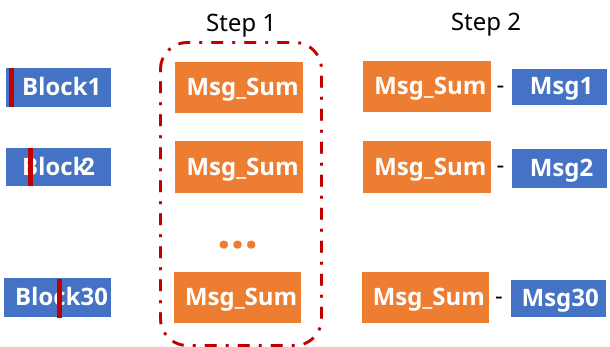

As a result, Edge-Based Parallelism performs well for low-throughput scenarios (a small number of segments) due to its high GPU occupancy. However, it hits a compute-bound limit when scaling up to decode a large number of segments. These redundant arithmetic operations easily use up the GPU's ALU resources. 

This limitation imposes us to consider **Node-Based Parallelism**, which  resolves this redundancy and eases the hardware resource burden.


### 5.2 Node-Based Parallelism

To fundamentally resolve the computational redundancy identified in the Edge-Based approach, we transition to a **Node-Based Parallelism** strategy. Instead of mapping one CUDA block to one edge (message), we map **one block to one node** (either a Check Node or a Bit Node).

#### 5.2.1 Node-Based Parallelism Explained

The core philosophy of Node-Based parallelism is to calculate the shared intermediate result (the aggregate sum or global minimums) exactly *once* per node, cache it in local registers, and then reuse it to compute all outgoing messages.

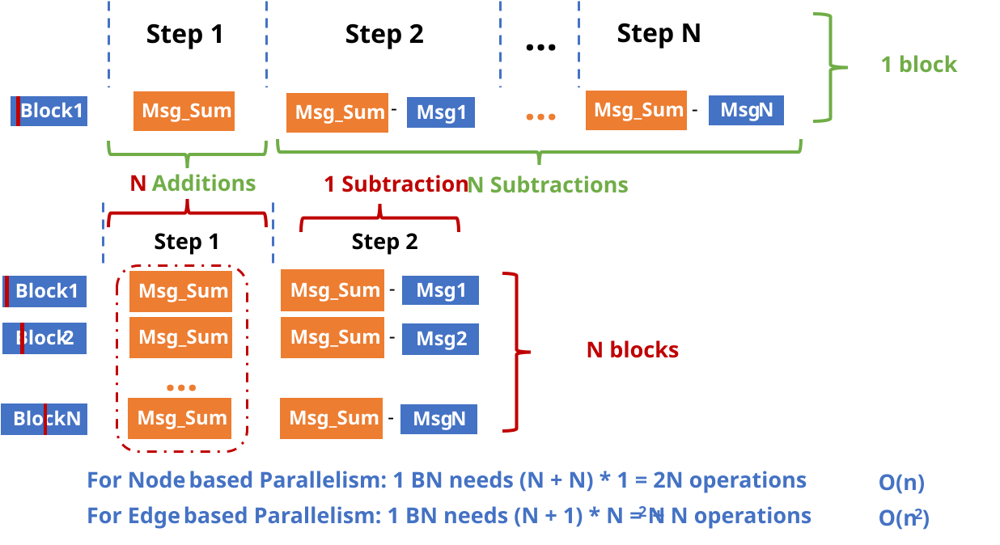

As illustrated in the diagram above, consider a node with a degree of $N$:
* **Edge-Based (Redundant):** Requires $N$ independent blocks. Each block computes the `Msg_Sum` from scratch ($N$ additions) and then performs 1 subtraction. 
  * Total Operations: $N \times (N + 1) = N^2 + N \rightarrow \mathbf{O(N^2)}$
* **Node-Based (Optimized):** Uses exactly 1 block. The block computes the `Msg_Sum` once ($N$ additions) in Step 1. In Step 2, it loops through the $N$ edges, performing $N$ subtractions using the cached sum. 
  * Total Operations: $N + N = 2N \rightarrow \mathbf{O(N)}$

This dramatic reduction in arithmetic complexity from quadratic to linear thoroughly unblocks the GPU ALU bottleneck, especially for high-degree nodes.

#### 5.2.2 Thread Organization

The thread organization follows this updated 2D grid/block topology:

* **X-Dimension (Lifting Size & Nodes):** We continue to utilize 32-bit `simd4` vectorized loads/stores, meaning the block's X-dimension remains scaled to $Z_c / 4$ (`Z >> 2`). However, the Y-dimension of the block is now set to 4 to process **4 nodes** concurrently within a single block. Consequently, the grid's X-dimension represents the total number of Check Nodes or Bit Nodes divided by 4. Ceiling division (`+ 3`) is applied to handle cases where the total number of nodes is not a multiple of 4.
* **Y-Dimension (Segments):** The grid's Y-dimension continues to map directly to the number of Transport Block segments (`n_segments`), decoding multiple code blocks in parallel.

Because Check Nodes (CN) and Bit Nodes (BN) possess different totals depending on the Base Graph and code rate, their execution grids are launched separately. The precise kernel launch configurations for the supported code rates in BG1 are formulated as follows:

```cpp
// Node-Based Block Configuration (Universal across all rates and node types)
// X: Z/4 threads for simd4 access, Y: 4 nodes processed concurrently
dim3 Node_block(Z >> 2, 4, 1);

```

```cpp
// BG1 Rate 1/3 configurations
//num_TotalBlocks_cn_BG1_R13_Node = 46
dim3 cn_R13_grid((num_TotalBlocks_cn_BG1_R13_Node + 3) >> 2, n_segments, 1);
//num_TotalBlocks_bn_BG1_R13_Node = 68
dim3 bn_R13_grid(num_TotalBlocks_bn_BG1_R13_Node >> 2, n_segments, 1); 

```

```cpp
// BG1 Rate 2/3 configurations
//num_TotalBlocks_cn_BG1_R23_Node = 13
dim3 cn_R23_grid((num_TotalBlocks_cn_BG1_R23_Node + 3) >> 2, n_segments, 1);
//num_TotalBlocks_bn_BG1_R23_Node = 35
dim3 bn_R23_grid((num_TotalBlocks_bn_BG1_R23_Node + 3) >> 2, n_segments, 1); 

```

```cpp
// BG1 Rate 8/9 configurations
//num_TotalBlocks_cn_BG1_R89_Node = 5
dim3 cn_R89_grid((num_TotalBlocks_cn_BG1_R89_Node + 3) >> 2, n_segments, 1);
//num_TotalBlocks_bn_BG1_R89_Node = 27
dim3 bn_R89_grid((num_TotalBlocks_bn_BG1_R89_Node + 3) >> 2, n_segments, 1); 

```


#### 5.2.3 cnProc_kernel

For the Check Node processing in Node-Based mode, we implemented specific kernels for each code rate:
* `cnProcKernel_BG1_R13_int8_Node`
* `cnProcKernel_BG1_R23_int8_Node`
* `cnProcKernel_BG1_R89_int8_Node`

Unlike the edge-based dispatcher, the global index `row` now points to a unique **Check Node** rather than a message.

```cpp
__global__ void cnProcKernel_BG1_R13_int8_Node(const int8_t *__restrict__ d_cnBufAll,
                                               int8_t *__restrict__ d_bnBufAll,
                                               uint32_t Zc,
                                               uint32_t ZcIdx)
{
  uint32_t lane = threadIdx.x;
  uint32_t row = (blockIdx.x << 2) + threadIdx.y;
  uint32_t segIdx = blockIdx.y;

  if (row >= num_TotalBlocks_cn_BG1_R13_Node)
    return;

  // 1D Indexing resolves the specific Check Node and its parameters
  uint32_t CnGrpIdx = lut_CnGrpIdx_BG1_R13_Node[row] - 1;
  uint32_t CnIdx = lut_CnIdx_BG1_R13_Node[row] - 1;
  uint32_t InnerOffset = d_lut_startAddrCnGroups_BG1[CnGrpIdx] + NR_LDPC_ZMAX * CnIdx;
  uint32_t Cn2MsgStartIdx = lut_CnStartMsgIdx_BG1_R13_Node[row];
  uint32_t CnGrpIdxNum = d_lut_numBnInCnGroups_BG1_R13[CnGrpIdx];
  uint32_t CnNumInGrp = d_lut_numCnInCnGroups_BG1_R13[CnGrpIdx]; 

  const int8_t *p_cnProcBuf = (const int8_t *)(d_cnBufAll + segIdx * NR_LDPC_SIZE_CN_PROC_BUF + InnerOffset);
  int8_t *p_bnProcBuf = (int8_t *)(d_bnBufAll + segIdx * NR_LDPC_SIZE_BN_PROC_BUF);

  // Call the consolidated Node-Based device function
  cnProcKernel_BG1_int8_Gn_R13_node(p_cnProcBuf, p_bnProcBuf, lane, CnIdx, CnNumInGrp, CnGrpIdxNum, Cn2MsgStartIdx, Zc, ZcIdx);
}

```

The device function executes a classic 2-pass Min-Sum algorithm to achieve $O(N)$ efficiency.

* **Pass 1:** Find the absolute minimum (`min1`), the second minimum (`min2`), and the cumulative XOR sign (`total_xor`) of all connected edges.
* **Pass 2:** Generate the outgoing messages by applying the appropriate minimum value and sign, then write them back sequentially.

```cpp
__device__ __forceinline__ void cnProcKernel_BG1_int8_Gn_R13_node(/* ... parameters ... */)
{
  uint32_t min1 = 0x7F7F7F7F;
  uint32_t min2 = 0x7F7F7F7F;
  uint32_t total_xor = 0;

  // Local thread registers to cache values, avoiding redundant global memory access
  uint32_t cache_raw[19];
  uint32_t cache_abs[19];

  const int32_t *cnProcBufPtr = (const int32_t *)(d_cnProcBuf) + lane;
  const int32_t *currPtr = cnProcBufPtr;
  uint32_t offset = (CnNumInGrp * NR_LDPC_ZMAX) >> 2;

  // --- Pass 1: Global Extrema and Sign Accumulation ---
  #pragma unroll
  for (int MsgIdx = 0; MsgIdx < CnGrpIdxNum; MsgIdx++) {
    uint32_t val = *currPtr;

    cache_raw[MsgIdx] = val;
    uint32_t v_abs = __vabs4(val);
    cache_abs[MsgIdx] = v_abs;

    total_xor = __vxor4(total_xor, val);

    uint32_t old_min1 = min1;
    min1 = __vminu4(old_min1, v_abs);
    uint32_t candidate = __vmaxu4(old_min1, v_abs);
    min2 = __vminu4(min2, candidate);
    
    currPtr += offset;
  }

  // --- Pass 2: Message Generation and Write-Back ---
  #pragma unroll
  for (int temp_MsgIdx = 0; temp_MsgIdx < CnGrpIdxNum; temp_MsgIdx++) {
    uint32_t target_sign = __vxor4(total_xor, cache_raw[temp_MsgIdx]);
    uint32_t my_abs = cache_abs[temp_MsgIdx];

    // Branchless selection: If this edge was min1, use min2; otherwise use min1
    uint32_t is_min_mask = __vcmpeq4(my_abs, min1);
    uint32_t final_mag = (min2 & is_min_mask) | (min1 & ~is_min_mask);

    uint32_t BricksToBeMoved = __vsign4(final_mag, target_sign);

    uint32_t MsgIdx = Cn2MsgStartIdx + temp_MsgIdx;
    uint32_t circShift = cn_bn_map_BG1_Z_R13[MsgIdx][ZcIdx];
    int8_t *p_bnProcBuf = (int8_t *)(d_bnProcBuf + cn_bn_map_BG1_Z_R13[MsgIdx][0]);

    moveBricks_invput_circ(p_bnProcBuf, lane * 4, (uint8_t *)&BricksToBeMoved, Zc, circShift);
  }
}

```

#### 5.2.4 bnProc_kernel

The Bit Node update (`bnProc`) mirrors this $O(N)$ logic. We define specific node-based kernels for each code rate:

* `bnProcKernel_BG1_R13_int8_Node`
* `bnProcKernel_BG1_R23_int8_Node`
* `bnProcKernel_BG1_R89_int8_Node`

*(Note: The global dispatcher `bnProcKernel_BG1_R13_int8_Node` follows the exact same 1D node-indexing structure as the `cnProc` equivalent.)*

In the device function, the 2-pass strategy is implemented as:

* **Pass 1:** Accumulate all incoming edge messages and the intrinsic LLR into a single global sum (`MsgSumLo` / `MsgSumHi`).
* **Pass 2:** Iterate through the edges, subtract that specific edge's previous message from the global sum (`__vsubss4`), and scatter the updated messages back.

```cpp
__device__ __forceinline__ void bnProcKernel_BG1_int8_Gn_Node_R13(/* ... parameters ... */)
{
  const int32_t *bnProcBufPtr = (const int32_t *)(d_bnProcBuf) + lane;
  uint32_t packed_intrinsic = ((const int32_t *)(d_llrProcBuf))[lane];

  uint32_t MsgSumLo, MsgSumHi;
  unpack_and_sign_extend(packed_intrinsic, &MsgSumLo, &MsgSumHi);

  uint32_t off = (GrpNum * NR_LDPC_ZMAX) >> 2;
  const int32_t *currPtr = bnProcBufPtr;
  int i = 0;

  // --- Pass 1: 2-Way Unrolled Global Accumulation ---
  for (; i < (int)BnGrpIdx - 1; i += 2) {
    uint32_t val1 = *currPtr;
    uint32_t val2 = *(currPtr + off);

    uint32_t v1_lo, v1_hi;
    unpack_and_sign_extend(val1, &v1_lo, &v1_hi);
    MsgSumLo = __vaddss2(MsgSumLo, v1_lo);
    MsgSumHi = __vaddss2(MsgSumHi, v1_hi);

    uint32_t v2_lo, v2_hi;
    unpack_and_sign_extend(val2, &v2_lo, &v2_hi);
    MsgSumLo = __vaddss2(MsgSumLo, v2_lo);
    MsgSumHi = __vaddss2(MsgSumHi, v2_hi);

    currPtr += (off << 1);
  }

  if (i < BnGrpIdx) {
    uint32_t val = *currPtr;
    uint32_t v_lo, v_hi;
    unpack_and_sign_extend(val, &v_lo, &v_hi);
    MsgSumLo = __vaddss2(MsgSumLo, v_lo);
    MsgSumHi = __vaddss2(MsgSumHi, v_hi);
  }

  // Pack the total sum back into 8-bit integers
  uint32_t saturated_llr = saturate_and_pack(MsgSumLo, MsgSumHi);
  uint32_t BricksToBeGet;

  // --- Pass 2: Subtraction and Scatter Write-Back ---
  if (BnGrpIdx == 1) {
    // Degree-1 optimization: No subtraction needed
    BricksToBeGet = packed_intrinsic;
    uint32_t MsgIdx = Bn2MsgStartIdx;
    uint32_t circShift = bn_cn_map_BG1_Z_R13[MsgIdx][ZcIdx];
    int8_t *p_cnProcBuf = (int8_t *)(d_cnProcBuf + bn_cn_map_BG1_Z_R13[MsgIdx][0]);

    moveBricks_forput_circ(p_cnProcBuf, lane * 4, (uint8_t *)&BricksToBeGet, Zc, circShift);
  } else {
    for (int temp_MsgIdx = 0; temp_MsgIdx < BnGrpIdx; temp_MsgIdx++) {
      uint32_t prevIdxWords = (temp_MsgIdx * GrpNum * NR_LDPC_ZMAX) >> 2;
      uint32_t prev = bnProcBufPtr[prevIdxWords];
      
      // Crucial Step: Subtract the specific edge's previous message
      BricksToBeGet = __vsubss4(saturated_llr, prev); 
      
      uint32_t MsgIdx = Bn2MsgStartIdx + temp_MsgIdx;
      uint32_t circShift = bn_cn_map_BG1_Z_R13[MsgIdx][ZcIdx];
      int8_t *p_cnProcBuf = (int8_t *)(d_cnProcBuf + bn_cn_map_BG1_Z_R13[MsgIdx][0]);

      moveBricks_forput_circ(p_cnProcBuf, lane * 4, (uint8_t *)&BricksToBeGet, Zc, circShift);
    }
  }
}

```
 ### 5.3 Hybrid Approach & Switching Policy


#### 5.3.1 Resource vs. Speed Trade-off

The Edge-based approach computes all messages simultaneously, providing optimal latency (e.g., ~50µs) for single-segment workloads. However, its heavy resource consumption quickly saturates GPU Streaming Multiprocessors (SMs) when processing large batches. Conversely, the Node-based approach maps computations to graph nodes rather than edges, shrinking the resource footprint by a factor of the node degree ($N$). This footprint reduction prevents SM contention and delivers superior throughput for larger workloads.


#### 5.3.2 Dynamic Switching Policy

To balance latency and throughput, the decoder dynamically switches between Edge-based and Node-based kernels at runtime. This switching policy is determined by the number of code block segments (`n_segments`) being processed.

For small batch sizes (e.g., `n_segments = 1`), the scheduler executes Edge-based kernels to minimize single-segment latency. For larger batch sizes (e.g., `n_segments = 128`), the scheduler switches to Node-based kernels to maintain overall throughput and optimize SM occupancy.

The following code snippets illustrate this runtime switching mechanism. Empirical threshold parameters, such as `NodeEdge_Switch_Cn_R13`, are defined to trigger the transition:

```cpp
void nrLDPC_cnProc_BG1_R13_cuda_stream_core(int8_t *cnProcBuf,
                                            int8_t *bnProcBuf,
                                            uint32_t n_segments,
                                            uint32_t Z,
                                            uint32_t ZcIdx,
                                            cudaStream_t *streams,
                                            int8_t CudaStreamIdx)
{
  if (n_segments > NodeEdge_Switch_Cn_R13) {
    cnProcKernel_BG1_R13_int8_Node<<<Kdim_cn_R13_Node[CudaStreamIdx].grid,
                                     Kdim_cn_R13_Node[CudaStreamIdx].block,
                                     0,
                                     streams[CudaStreamIdx]>>>(cnProcBuf, bnProcBuf, Z, ZcIdx);
  } else {
    cnProcKernel_BG1_R13_int8_Edge<<<Kdim_R13_Edge[CudaStreamIdx].grid,
                                     Kdim_R13_Edge[CudaStreamIdx].block,
                                     0,
                                     streams[CudaStreamIdx]>>>(cnProcBuf, bnProcBuf, Z, ZcIdx);
  }

  CHECK(cudaGetLastError());
}

void nrLDPC_bnProc_BG1_R13_cuda_stream_core(int8_t *bnProcBuf,
                                            int8_t *cnProcBuf,
                                            int8_t *llrProcBuf,
                                            int8_t *llrRes,
                                            uint32_t n_segments,
                                            uint32_t Z,
                                            uint32_t ZcIdx,
                                            cudaStream_t *streams,
                                            int8_t CudaStreamIdx)
{
  if (n_segments > NodeEdge_Switch_Bn_R13) {
    bnProcKernel_BG1_R13_int8_Node<<<Kdim_bn_R13_Node[CudaStreamIdx].grid,
                                     Kdim_bn_R13_Node[CudaStreamIdx].block,
                                     0,
                                     streams[CudaStreamIdx]>>>(bnProcBuf, cnProcBuf, llrProcBuf, llrRes, Z, ZcIdx);
  } else {
    bnProcKernel_BG1_R13_int8_Edge<<<Kdim_R13_Edge[CudaStreamIdx].grid,
                                     Kdim_R13_Edge[CudaStreamIdx].block,
                                     0,
                                     streams[CudaStreamIdx]>>>(bnProcBuf, cnProcBuf, llrProcBuf, llrRes, Z, ZcIdx);
  }
  
  CHECK(cudaGetLastError());
}

```
It should be noted that the empirical switching thresholds obtained so far (e.g., NodeEdge_Switch_Cn_R13) were derived from actual performance testing on the NVIDIA GH200(See [Appendix A](#Appendix-A)). For different hardware platforms, these optimal thresholds are expected to vary depending on the available computational resources. A practical heuristic is to scale these thresholds proportionally based on the target hardware's compute resources relative to the GH200 (such as the number of Streaming Multiprocessors). Future work will explore a more precise, analytical method for determining these thresholds across diverse architectures.

## 6. System Integration and Performance Evaluation

#### 6.1 Pipeline Scheduling & Execution Flow

Beyond the arithmetic optimizations at the kernel level, the overall decoder latency is heavily influenced by CPU-side driver overhead, specifically the cost of launching hundreds of iterative CUDA kernels per Transport Block. To mitigate this, the decoder integrates a dynamic pipeline scheduling architecture centered around **CUDA Graphs**.

The execution lifecycle of a batch of incoming code blocks (`ldpc_decoder_cuda.c`) is governed by the following pipeline stages:

**1. Driver Initialization and Warm-up**
To prevent unpredictable latency in processing the first arriving network packets (often caused by lazy loading or JIT compilation within the NVIDIA driver), we perform a warm-up procedure(`init_decoder_warmup`). During init, the decoder allocates dummy buffers and pre-records CUDA graphs for common 5G NR configurations (e.g., Lifting Sizes $Z \in \{320, 352, 384\}$ and Base Graph 1, Rates 1/3 and 2/3). Executing these dummy graphs forces the GPU driver to fully initialize its execution context before real network traffic arrives.

**2. Dynamic Graph Caching and Execution**
The core scheduling logic (`nrLDPC_decoder_core_dynamic`) bypasses standard stream-based kernel launches by utilizing a state-aware graph cache (`gpu_graph_cache`). When a decoding request arrives, the scheduler inspects the decoding parameters (e.g., $Z$, Code Rate, `n_segments`, maximum iterations) and routes the execution through one of three paths:

* **Cache Hit (Fast Path):** If an existing graph matches the current configuration, the CPU overhead is minimized to an $O(1)$ cache lookup. The system updates the input/output buffer pointers via a memory bridge (`ldpc_cuda_bridge_t`) and directly launches the pre-recorded graph (`nrLDPC_decoder_cuda_GraphExecute`).
* **Cache Miss (Graph Record):** If no matching graph exists and the cache is not full, the system records a new CUDA Graph (`nrLDPC_decoder_cuda_GraphRecord`). This operation captures the exact sequence of kernels—including the Edge/Node hybrid switching policy defined in Section 5.3—into a single executable topology. Once recorded, the graph is cached and executed.
* **Normal Execution (Fallback):** In scenarios where graph operations fail, the cache capacity is exhausted, or the runtime environment actively breaks the graph logic (circuit breaker triggered), the scheduler safely falls back to standard, sequential CUDA kernel launches (`nrLDPC_decoder_cuda_NormalExecute`).

**3. Memory Management** 

In a fully GPU-accelerated L1 pipeline, the input LLRs from the preceding rate-matching module typically already reside in the GPU device memory. The decoder accepts these device pointers directly, avoiding PCIe transfer overhead.

To maintain API compatibility for partial-offload testing scenarios where inputs might originate from the host, the pipeline checks the memory space of the incoming pointer (`if (p_llr != p_llr_dev)`). It performs an asynchronous PCIe copy (`cudaMemcpyAsync`) only if a host pointer is detected. Additionally, for integrated architectures like the NVIDIA GH200, the implementation supports zero-copy memory access, mapping pageable or integrated host pointers directly without explicit data migration.


### 6.2 Throughput Analysis

#### 6.2.1 Error Correction Performance (BLER Validation)

To guarantee that the architectural transformations—including 8-bit saturation, SIMD4 vectorization, and Node-Based graph restructuring—do not compromise the mathematical integrity of the decoder, we benchmarked the Block Error Rate (BLER) against the standard OAI CPU baseline.

The BLER vs. SNR curves indicate that the CUDA GPU implementation performs consistently with the CPU baseline. Across the evaluated code rates (BG1 Rate 1/3, Rate 2/3, and Rate 8/9) in an AWGN channel, the decoding trajectories of the GPU and CPU implementations overlap. This demonstrates that the proposed GPU offloading strategies do not compromise the error correction performance.
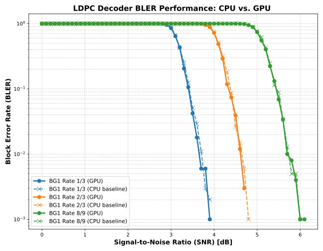

*(Tested with 5 iterations)*

#### 6.2.2 Latency vs. Throughput Scalability


Following the validation of decoding accuracy, the hardware acceleration performance was evaluated on the NVIDIA GH200 architecture. The primary performance metrics include single-segment processing latency and overall decoding throughput, measured across varying workloads (number of code block segments, `n_segments`).

The measurements illustrate the scalability facilitated by the Dynamic Hybrid Switching policy detailed in Section 5.3. By calibrating the `NodeEdge_Switch` thresholds according to the Streaming Multiprocessor (SM) capacity of the GH200, the scheduler enables a transition across different operational regimes.

**Low-Latency Regime (Edge-Based Processing)**
For smaller batch sizes (e.g., `n_segments = 1` to `4`), the scheduler selects the Edge-Based kernels. In this regime, the concurrent thread deployment reduces the absolute decoding time. The implementation records a single-segment decoding latency ranging from approximately **50 µs** to **61 µs** (measured at 5 iterations). This processing time aligns with the latency requirements associated with 5G URLLC (Ultra-Reliable Low-Latency Communication) scenarios.

**High-Throughput Regime (Node-Based Processing)**
As the workload scales to simulate higher-load eMBB (Enhanced Mobile Broadband) base station conditions, the scheduler transitions to the Node-Based kernels. This transition mitigates SM saturation by reducing the algorithmic complexity from $O(N^2)$ to $O(N)$.

With the switching thresholds calibrated to the hardware characteristics, the throughput curve exhibits an initial ascent before plateauing near the hardware limit. Under maximum evaluated parallel segment loading (`n_segments = 128`), the GPU decoder reaches peak sustained throughputs of **~3.5 Gbps** for Rate 1/3, **~5.5 Gbps** for Rate 2/3, and **>8.0 Gbps** for Rate 8/9.


The table below summarizes the measured throughput and latency metrics across different segment batch sizes on the GH200:

<details>
<summary><b>Click to expand: Raw Performance Metrics (GH200)</b></summary>

| `n_segments` | R13 Latency (µs) | R13 Tput (Gbps) | R23 Latency (µs) | R23 Tput (Gbps) | R89 Latency (µs) | R89 Tput (Gbps) |
| --- | --- | --- | --- | --- | --- | --- |
| **1** | 61.66 | 0.137 | 54.04 | 0.156 | 49.79 | 0.170 |
| **2** | 69.98 | 0.241 | 54.62 | 0.309 | 51.45 | 0.328 |
| **4** | 78.24 | 0.432 | 58.65 | 0.576 | 55.17 | 0.612 |
| **8** | 91.52 | 0.738 | 68.89 | 0.981 | 56.89 | 1.188 |
| **16** | 116.76 | 1.157 | 81.95 | 1.649 | 72.64 | 1.861 |
| **32** | 157.88 | 1.712 | 105.75 | 2.556 | 81.60 | 3.313 |
| **64** | 197.88 | 2.732 | 124.73 | 4.335 | 106.36 | 5.083 |
| **128** | 303.47 | 3.563 | 195.77 | 5.523 | 134.42 | 8.044 |

*(Note: Throughput calculations are based on $K=8448$ information bits per segment. Values are measured at 5 decoding iterations.)*

</details>

---

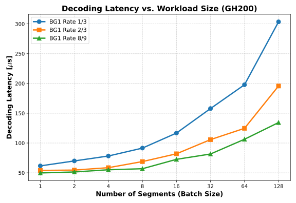
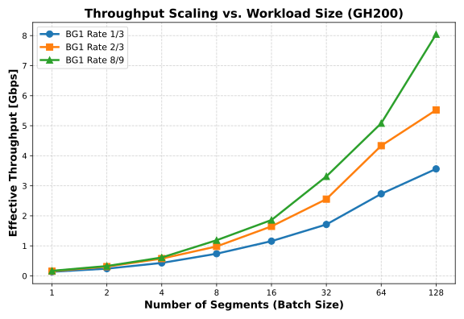


---
<a id="Appendix-A"></a>
## Appendix A: Node-Edge Performance Profiling on GH200

To validate the bottleneck shift from kernel launch overhead to SM computational saturation, an exhaustive profiling was conducted on the NVIDIA Grace Hopper (GH200) platform.

The architectures evaluated are defined as follows:

* **EE (Baseline)**: Edge-based `cnProc` + Edge-based `bnProc`.
* **EN (Hybrid A)**: Edge-based `cnProc` + Node-based `bnProc`. 
* **NE (Hybrid B)**: Node-based `cnProc` + Edge-based `bnProc`. 
* **NN (Proposed)**: Node-based `cnProc` + Node-based `bnProc`.

The tables below record the per-segment execution time ($\mu s$) under varying workload scales ($S$).

### A.1 Performance Comparison for Rate 1/3 (BG1)

| Segments ($S$) | EE (Baseline) | EN (Hybrid A) | NE (Hybrid B) | NN (All Node) | Best Arch. |
| --- | --- | --- | --- | --- | --- |
| **1** | 52.055 | 76.164 | 75.641 | 98.361 | **EE** |
| **2** | 30.724 | 39.726 | 40.552 | 50.658 | **EE** |
| **4** | 17.457 | 20.873 | 22.259 | 25.478 | **EE** |
| **8** | 10.815 | 11.664 | 12.725 | 13.481 | **EE** |
| **16** | 8.038 | 7.080 | 8.468 | 7.485 | **EN** |
| **32** | 6.204 | 4.824 | 6.112 | 4.713 | **NN** |
| **64** | 5.251 | 3.461 | 4.884 | 3.100 | **NN** |
| **128** | 4.793 | 2.905 | 4.342 | 2.423 | **NN** |

### A.2 Performance Comparison for Rate 2/3 (BG1)

| Segments ($S$) | EE (Baseline) | EN (Hybrid A) | NE (Hybrid B) | NN (All Node) | Best Arch. |
| --- | --- | --- | --- | --- | --- |
| **1** | 46.088 | 54.576 | 67.666 | 74.247 | **EE** |
| **2** | 23.429 | 27.522 | 35.105 | 38.476 | **EE** |
| **4** | 12.763 | 14.673 | 18.467 | 20.560 | **EE** |
| **8** | 7.611 | 8.030 | 9.977 | 10.521 | **EN** |
| **16** | 4.791 | 4.721 | 5.588 | 5.491 | **EN** |
| **32** | 3.416 | 3.115 | 3.416 | 3.073 | **NN** |
| **64** | 2.670 | 2.267 | 2.375 | 1.953 | **NN** |
| **128** | 2.297 | 1.867 | 2.061 | 1.597 | **NN** |

### A.3 Performance Comparison for Rate 8/9 (BG1)

| Segments ($S$) | EE (Baseline) | EN (Hybrid A) | NE (Hybrid B) | NN (All Node) | Best Arch. |
| --- | --- | --- | --- | --- | --- |
| **1** | 44.686 | 48.255 | 68.518 | 70.156 | **EE** |
| **2** | 21.895 | 24.895 | 35.236 | 36.256 | **EE** |
| **4** | 11.493 | 13.221 | 17.876 | 19.112 | **EE** |
| **8** | 6.551 | 7.100 | 9.245 | 9.867 | **EE** |
| **16** | 3.824 | 4.142 | 5.123 | 5.257 | **EE** |
| **32** | 2.604 | 2.554 | 2.928 | 2.842 | **EN** |
| **64** | 1.896 | 1.751 | 1.759 | 1.646 | **NN** |
| **128** | 1.464 | 1.349 | 1.213 | 1.084 | **NN** |

---
**Analysis summary:** Compared to the baseline (EE), the EN architecture eases the computational burden of `bnProc`, and the NE architecture eases the burden of `cnProc`. As the workload ($S$) scales up, the performance improvement from EN is greater than that of NE. This indicates that the Variable Node processing (`bnProc`) acts as the main parallelization bottleneck in the traditional Edge-centric paradigm. Therefore, adopting the fully Node-centric architecture (NN) addresses both bottlenecks, providing better performance in high-load scenarios.


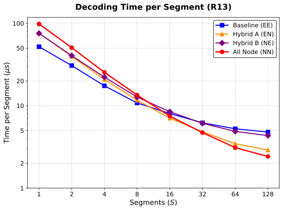
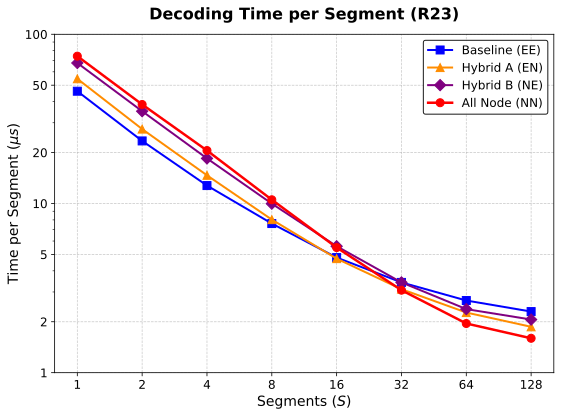
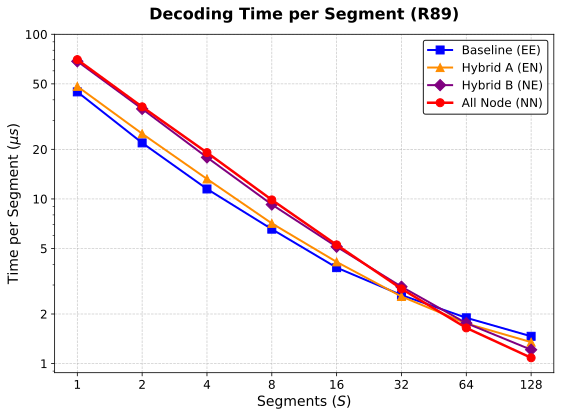
